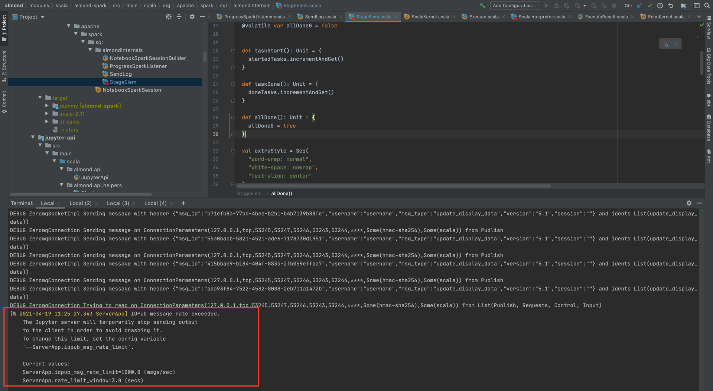

## 背景

在Jupyter Scala内核（Almond Scala内核），当运行Spark SQL时会偶发的卡主（Jupyter lab还显示running状态，但到Spark ui中查看已经运行结束了）

由于排查内核问题，成本较高，所以想先简单调研下其他的Jupyter Scala内核实现

## 其他内核实现简单调研

目前开源的Jupyter Scala内核：[参考链接](https://github.com/jupyter/jupyter/wiki/Jupyter-kernels)

### Almond (当前MTJupyter所选方案)

[GitHub](https://github.com/almond-sh/almond)
[官方文档](https://almond.sh/docs/0.3.1/quick-start-install)

启动内核后可以根据自己需要随意配置Spark并启动，输出数据比较美观，文档丰富，社区较为活跃

### IScala

[GitHub](https://github.com/mattpap/IScala)

依赖于IPython，Scala 2.10.2，没有使用Spark相关案例，项目不活跃，最近一次提交已经是七年前

### Toree

[GitHub](https://github.com/apache/incubator-toree)

安装内核的时候就要指定好Spark配置，启动内核就相当于执行spark-submit，用户使用不友好不方便，输出数据展示不好看

#### 安装 

```bash
pip install toree==0.4.0

jupyter toree install \
--sys-prefix /conda/envs/notebook/ \
--replace \
--debug \
--kernel_name 'Toree Scala Debug' \
--spark_home=/opt/spark-2.2 \
--spark_opts='--master=yarn --deploy-mode=client --name=test --driver-memory=14G --executor-memory=8G --conf=spark.dynamicAllocation.enabled=true --conf=spark.shuffle.service.enabled=true --queue=root.test'
```

### 总结

Toree和IScala无法灵活配置Spark，输出样式不美观，社区活跃度不高，所以只能继续使用Almond，开始尝试修复Almond当前bug

## 尝试排查问题

使用 [papermill](https://github.com/nteract/papermill) 执行打debug日志

命令
```bash
papermill --log-output --log-level=DEBUG test.ipynb  test_output.ipynb
```

发现内核卡在某个stage，更新task非常慢，偶尔超时直接内核挂掉，有时一直卡住，因为使用的是papermill，所以直接排除了Jupyter lab端导致的问题

后来发现当一个stage中task过多的时候就基本会稳定复现这个问题，比如下面这段代码

代码
```scala
import $ivy.`org.apache.spark::spark-sql:2.2.1` // Or use any other 2.x version here
import $ivy.`sh.almond::almond-spark:0.6.1-SNAPSHOT`

import org.apache.spark.sql._

val spark = {
  NotebookSparkSession
    .builder()
    .master("local[*]")
    .getOrCreate()
}

spark.range(10000000).repartition(5000).count
```

直接本地调试(进入到调试状态鬼知道经历了什么！！)打日志发现，是发送的消息超过限制了



由于jupyter client和内核层消息框架用的是zeromq，所以简单了解了一下zeromq的消息机制，由于使用的pub/sub模式，直接找到对应的 [介绍文档](https://zeromq.org/socket-api/)


所以当zero sub端接收消息超出限制（jupyter server端配置1000msgs/sec），就会丢弃后面的消息，所以很明显问题就是出在了丢弃消息上，也就是执行状态的消息被丢失了，解决这个问题有几种思路

1. 调大jupyter server端的1000msgs/sec配置
1. 降低消息输出速率

- 1 Jupyter官方设置这个默认值肯定有他的深意，不想随意调整默认值
- 2 找到产出消息的源头，我们是否可以降低这个消息的频率，避免最终执行状态的消息被丢弃

到Almond代码中找到对应的Spark监听类

ProgressSparkListener.scala
```scala
  override def onStageSubmitted(stageSubmitted: SparkListenerStageSubmitted): Unit =
    if (progress)
      Try {
        val elem = newStageElem(
          stageSubmitted.stageInfo.stageId,
          stageSubmitted.stageInfo.numTasks,
          stageSubmitted.stageInfo.name,
          stageSubmitted.stageInfo.details
        )
        elem.init(commTargetName, !sentInitCode)
        sentInitCode = true
      }

  override def onStageCompleted(stageCompleted: SparkListenerStageCompleted): Unit =
    if (progress)
      Try {
        val elem = stageElem(stageCompleted.stageInfo.stageId)
        elem.allDone()
        // 更新stage进度
        elem.update()
      }

  override def onTaskStart(taskStart: SparkListenerTaskStart): Unit =
    if (progress)
      Try {
        val elem = stageElem(taskStart.stageId)
        elem.taskStart()
        // 更新task进度，相当于给notebook client发送消息，然后client端通过websocket发给前端
        elem.update()
      }

  override def onTaskEnd(taskEnd: SparkListenerTaskEnd): Unit =
    if (progress)
      Try {
        val elem = stageElem(taskEnd.stageId)
        elem.taskDone()
        // 更新task进度，相当于给notebook client发送消息，然后client端通过websocket发给前端
        elem.update()
      }
```

所以Almond-Spark进度条当一个stage中的task开始或者结束都会执行elem.update()，调用publish.html("spark progress info...")，更新当前的进度信息，并发送消息到Jupyter Client，在回头看我们之前执行的代码

```scala
spark.range(10000000).repartition(5000).count
```

这个会产生一个有5000个task的stage，也就是说会发送一万条的消息，当spark执行task比较快的时候，比如说每秒有1000个以上的任务有启停动作，就会导致jupyter丢弃相关的消息，导致最终执行状态的消息也有可能被丢弃，所以Jupyter Lab显示一直running状态

对方案2（降低产出消息速率）进行两种尝试：

1. 直接不发送进度信息，直接注释掉
1. 降低发送进度信息速率，定时更新进度，每秒更新一次

再次实验，两种方案都可以完美解决，[Git地址](https://github.com/icankeep/almond/pull/1/commits/77e3b8c1ed5dbccc1770ae524158a5975ebe3bef) 

### 附：编译环境准备

[coursier文档](https://get-coursier.io/docs/cache.html#location)

[Almond文档](https://almond.sh/docs/usage-spark)

```bash
# clone 内核代码
cd ~/work/code
git clone git@github.com:almond-sh/almond.git

# 因为集团使用的是Spark2.2 对应的Scala是2.11，所以我们需要切到Scala2.11最新的commit （当前Almond Scala2.11已经没有维护）
git reset --hard b711f116

# 配置编译环境（坑点非常多！！）
curl -sL https://github.com/sbt/sbt/releases/download/v1.2.8/sbt-1.2.8.zip | tar -xf - -C ~/software
# 会报下图1的错，需要切到1.3.2版本以上再切回，如果直接用1.3.2也不行，必须切一下版本
export PATH=~/software/sbt/bin:$PATH

vim ~/.sbt/repositories
[repositories]
local
aliyun: https://maven.aliyun.com/repository/public/
huaweicloud-maven: https://repo.huaweicloud.com/repository/maven/
maven-central: https://repo1.maven.org/maven2/
sbt-plugin-repo: https://repo.scala-sbt.org/scalasbt/sbt-plugin-releases, [organization]/[module]/(scala_[scalaVersion]/)(sbt_[sbtVersion]/)[revision]/[type]s/[artifact](-[classifier]).[ext]


echo "-Dsbt.override.build.repos=true" >> ~/software/sbt/conf/sbtconfig.txt

cd ~/word/code/almond
# 编译并启动本地Jupyter Lab进行调试
sbt ++2.11.12 jupyterStart shell
# 可以在另一个terminal进行热点部署
sbt ~scala-kernel/pack
# 发布到本地仓库
sbt ++2.11.12 publishLocal

```

http://dblab.xmu.edu.cn/blog/maven-network-problem/

图1


依赖冲突，必须exclude一下依赖，再添加合适的依赖版本


exclude依赖


添加合适版本的依赖


```bash
sbt ++2.11.12 publishLocal

# 本地
SCALA_VERSION=2.11.12 ALMOND_VERSION=0.6.1-SNAPSHOT
./coursier.sh bootstrap \
  -r https://maven.aliyun.com/repository/public/ \
  -r central \
  sh.almond:scala-kernel_$SCALA_VERSION:$ALMOND_VERSION \
  --sources --default=true \
  -o almond-snapshot --standalone
  
 SCALA_VERSION=2.11.12 ALMOND_VERSION=0.6.1-SNAPSHOT
./coursier.sh bootstrap \
  sh.almond:scala-kernel_$SCALA_VERSION:$ALMOND_VERSION \
  --sources --default=true \
  -o almond-snapshot --standalone
  
 # docker
./almond-snapshot --install --force --jupyter-path "$CONDA_DIR/envs/notebook/share/jupyter/kernels" \
  --id scala211 \
  --display-name "Scala (2.11)" \
  --predef-code "java.nio.file.Files.list(java.nio.file.Paths.get(\"/opt/scala/lib\")).toArray.map(_.toString).foreach(jar => interp.load.cp(ammonite.ops.Path(jar)));java.nio.file.Files.list(java.nio.file.Paths.get(\"/opt/spark-2.2/jars\")).toArray.map(_.toString).foreach(jar => interp.load.cp(ammonite.ops.Path(jar)));interp.load.cp(ammonite.ops.Path(\"/opt/hadoop/share/hadoop/yarn/lib/hadoop-lzo-0.4.20-SNAPSHOT.jar\"));System.setProperty(\"java.security.krb5.conf\",\"/opt/hadoop/etc/hadoop/krb5.conf\");import \$ivy.{\`sh.almond::almond-spark:0.6.1-SNAPSHOT\`}" \
  --extra-repository http://maven.aliyun.com/repository/central \
  --extra-repository http://mvnrepository.com \
  --extra-repository https://repo1.maven.org/maven2
  
  # 本地
  ./almond-snapshot --install --force --jupyter-path "~/conda/envs/python3.6.7/share/jupyter/kernels" \
  --id scala-local-211 \
  --display-name "Scala local (2.11)" \
  --extra-repository http://maven.aliyun.com/repository/central \
  --extra-repository http://mvnrepository.com \
  --extra-repository https://repo1.maven.org/maven2
    
 ./coursier.sh fetch -p --no-default \
    -r http://maven.aliyun.com/repository/central \
     com.github.jupyter:jvm-repr:0.4.0
     
 ./coursier fetch -p --no-default \
     -r http://maven.aliyun.com/repository/central \
     com.fasterxml.jackson.core:jackson-databind:2.6.5 
    
 Deps.metabrowseServer exclude("com.fasterxml.jackson.core", "jackson-databind"),

```

```json
{
  "language" : "scala",
  "display_name" : "Scala (2.11.12)",
  "argv" : [
    "/conda/envs/notebook/share/jupyter/kernels/scala211/pack/bin/scala-kernel",
    "--id",
    "scala211",
    "--predef-code",
    "java.nio.file.Files.list(java.nio.file.Paths.get(\"/opt/scala/lib\")).toArray.map(_.toString).foreach(jar => interp.load.cp(ammonite.ops.Path(jar)));java.nio.file.Files.list(java.nio.file.Paths.get(\"/opt/spark-2.2/jars\")).toArray.map(_.toString).foreach(jar => interp.load.cp(ammonite.ops.Path(jar)));interp.load.cp(ammonite.ops.Path(\"/opt/hadoop/share/hadoop/yarn/lib/hadoop-lzo-0.4.20-SNAPSHOT.jar\"));System.setProperty(\"java.security.krb5.conf\",\"/opt/hadoop/etc/hadoop/krb5.conf\");import $ivy.{`sh.almond::almond-spark:0.6.1-SNAPSHOT`}",
    "--extra-repository",
    "http://maven.aliyun.com/repository/central",
    "--connection-file",
    "{connection_file}"
  ]
}
```

```
project scala-interpreter
whatDependsOn com.fasterxml.jackson.core jackson-databind 2.6.5

# 两个%%的坑 https://www.scala-sbt.org/1.x/docs/zh-cn/Library-Dependencies.html
def jackson = "com.fasterxml.jackson.core" % "jackson-databind" % "2.6.5"
```


