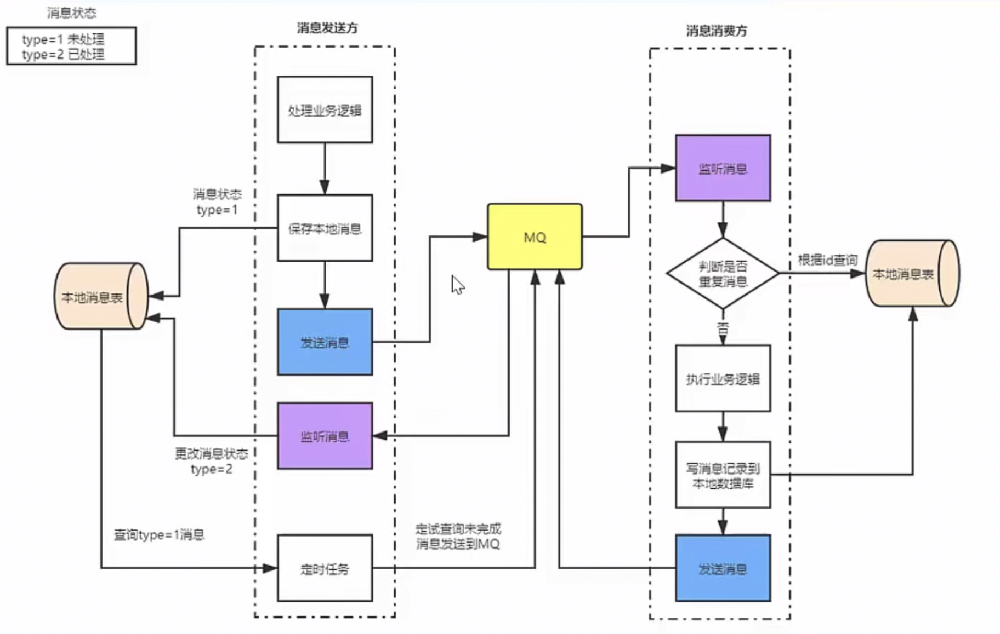

# 消息队列

消息队列可以解决应用解耦、异步消息、流量削锋等问题，是实现高性能、高可用、可伸缩和最终一致性架构中不可以或缺的一环。

现在比较常见的消息队列产品主要有ActiveMQ、RabbitMQ、ZeroMQ、Kafka、RocketMQ等。

## 为什么要用消息队列
- 解耦：传统使用RPC调用，下游系统崩溃，会影响上游系统
- 异步：对于一些无需依赖返回可以用MQ
- 削峰：可以将瞬时流量缓存，慢慢消化

## 各种消息队列产品的对比
- 吞吐量：RocketMQ和Kafka 支持十万级吞吐量，ActiveMQ和RabbitMQ支持万级吞吐量
- 时效性：ActiveMQ、RocketMQ ms级，Kafka ms以内，RabbitMQ us级
- 可用性：RocketMQ和Kafka非常高 分布式架构，ActiveMQ和RabbitMQ高 主从架构

ActiveMQ: 早期使用的较多，没经过大规模吞吐量场景的验证，社区也不是很活跃
RabbitMQ：erlang开发不可控，但是开源，比较稳定的支持，活跃度也高，如不考虑二次开发，追求性能和稳定性，推荐使用
RocketMQ：Java开发，在阿里内部经受过高并发业务的考验，稳定性和性能均不错，考虑后期可能二次开发，推荐使用
Kafka：大数据领域的实时计算、日志采集等场景，用Kafka是业内标准，社区活跃度很高，推荐使用。

## 消息队列的优点和缺点
优点：
缺点：
- 系统可用性降低：一旦MQ宕机，就会对业务造成影响
- 系统复杂性变高：消息丢失？重复消息？消息顺序性？
- 一致性问题：下游系统B,C,D  BC成功 D失败，一致性产生问题，需要引入分布式事务

## 如何保证消息队列的高可用

RabbitMQ：
- 普通集群：master存储数据，slave存储queue元数据从master拉取，没有真正的高可用，有数据拉取的开销和单实例的瓶颈问题
- 镜像集群：每个节点都有完整数据，节点间同步消息

RocketMQ：
- 双主双从

## 如何保证消息不丢失
消息怎么会丢失？
- 消息生产者没有成功发送到MQ Broker
- 消息发送到MQ Broker，内存中的数据丢失
- 消费者获取到消息，但消费者还没有来得及处理就宕机了，但此时MQ已经删除了消息，消费者重启之后不能再消费之前的消息

确保消息不丢失
- 消息发送者发送给MQ Broker后，MQ Broker给生产者发送确认收到
- MQ Broker收到消息后持久化
- 消费者收到消息处理完毕后手动进行ack确认
- MQ收到消费者ack确认后删除持久化的消息

## 如何保证消息不被重复消费？如何保证消息消费的幂等性？
消息重复的根本原因是网络不可达，因网络等原因导致的应答失败

分布式全局ID，消费前先确定是否已消费

## 如何保证消息消费的顺序性？
全局顺序消息和局部顺序消息
- 生产者根据消息ID将同一组消息发送到同一个Queue中
- 多个消费者同时获取Queue中的消息进行消费
- MQ使用分段锁保证单个Queue中的有序消费

https://zhuanlan.zhihu.com/p/430215410

## 基于MQ的分布式事务实现

## RocketMQ文档
https://rocketmq.apache.org/docs/order-example/

