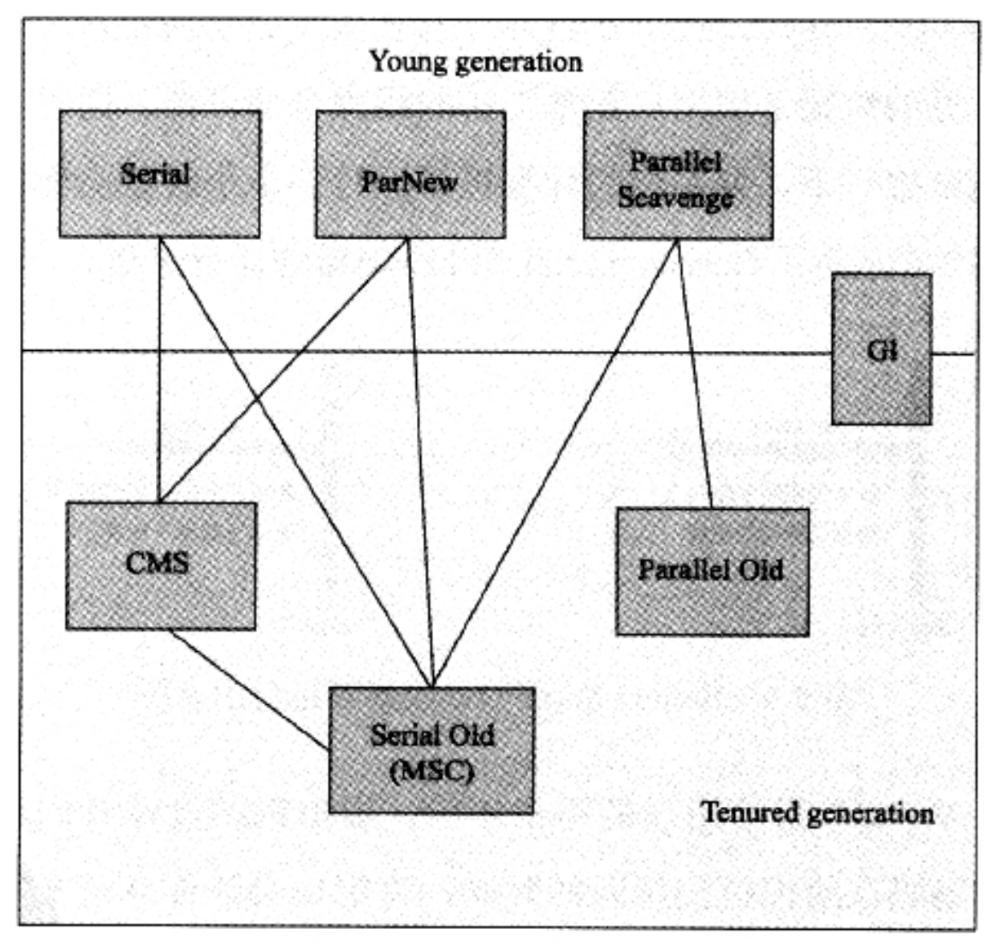

- 虚拟机运行时内存区域？
- GCRoot? 对象可达性算法分析？引用计数算法？
- 对象的几种引用类型？
- 几种垃圾回收算法？
    新生代一般使用复制算法，老年代一般使用标记整理算法
    
    
- 频繁fullgc怎么排查?
- 几个常见的虚拟机命令，jstack, jmap, jhat
- 类加载器（启动类加载器、扩展类加载器、应用程序类加载器，自定义类加载），双亲委派模型，双亲委派模型被破坏
- Tomcat类加载器架构
