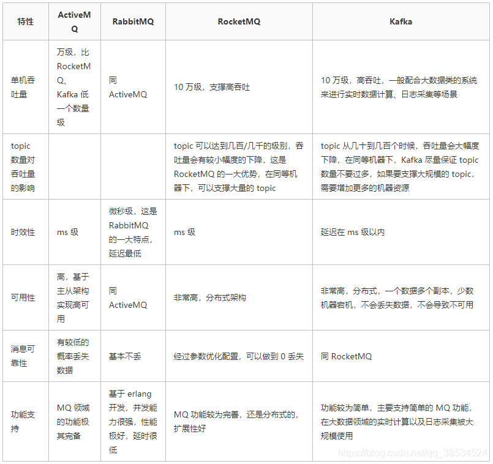
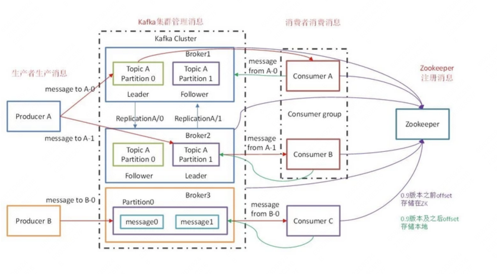
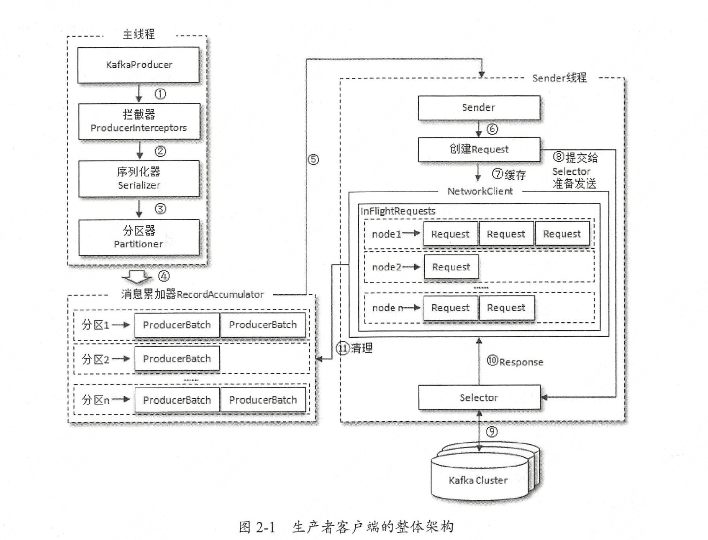
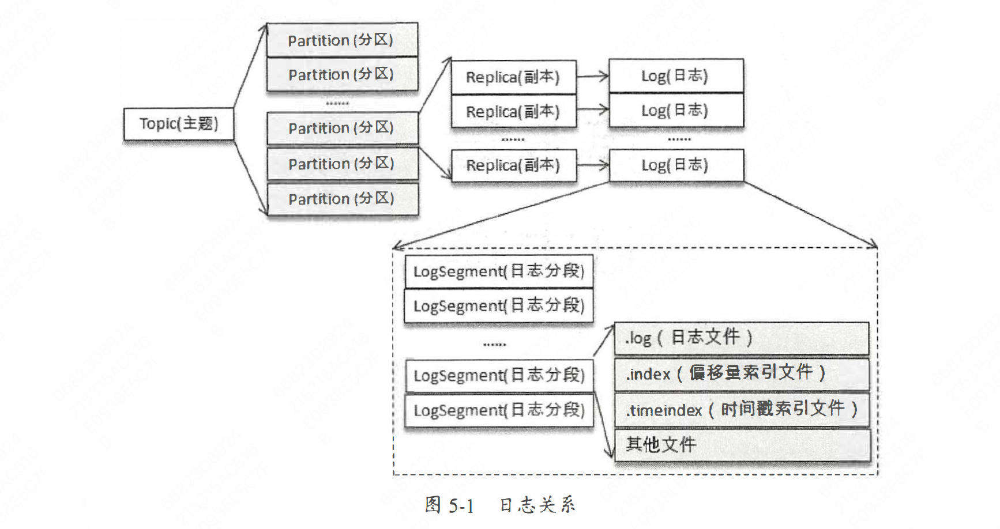

<!-- START doctoc generated TOC please keep comment here to allow auto update -->
<!-- DON'T EDIT THIS SECTION, INSTEAD RE-RUN doctoc TO UPDATE -->
**Table of Contents**  *generated with [DocToc](https://github.com/thlorenz/doctoc)*

- [Kafka总结](#kafka%E6%80%BB%E7%BB%93)
  - [几种消息队列比较](#%E5%87%A0%E7%A7%8D%E6%B6%88%E6%81%AF%E9%98%9F%E5%88%97%E6%AF%94%E8%BE%83)
  - [Kafka特点](#kafka%E7%89%B9%E7%82%B9)
  - [kafka架构](#kafka%E6%9E%B6%E6%9E%84)
    - [主要角色及名词](#%E4%B8%BB%E8%A6%81%E8%A7%92%E8%89%B2%E5%8F%8A%E5%90%8D%E8%AF%8D)
    - [主要流程原理梳理](#%E4%B8%BB%E8%A6%81%E6%B5%81%E7%A8%8B%E5%8E%9F%E7%90%86%E6%A2%B3%E7%90%86)
      - [Kafka发送消息流程](#kafka%E5%8F%91%E9%80%81%E6%B6%88%E6%81%AF%E6%B5%81%E7%A8%8B)
        - [生产者拦截器 Interceptor](#%E7%94%9F%E4%BA%A7%E8%80%85%E6%8B%A6%E6%88%AA%E5%99%A8-interceptor)
      - [Kafka消费消息](#kafka%E6%B6%88%E8%B4%B9%E6%B6%88%E6%81%AF)
      - [事务消息](#%E4%BA%8B%E5%8A%A1%E6%B6%88%E6%81%AF)
      - [日志](#%E6%97%A5%E5%BF%97)
        - [写入日志的两种方式：](#%E5%86%99%E5%85%A5%E6%97%A5%E5%BF%97%E7%9A%84%E4%B8%A4%E7%A7%8D%E6%96%B9%E5%BC%8F)
        - [写入索引](#%E5%86%99%E5%85%A5%E7%B4%A2%E5%BC%95)
        - [读取日志](#%E8%AF%BB%E5%8F%96%E6%97%A5%E5%BF%97)
      - [leader选举](#leader%E9%80%89%E4%B8%BE)
  - [常见的问题](#%E5%B8%B8%E8%A7%81%E7%9A%84%E9%97%AE%E9%A2%98)
    - [消息选择partition策略，以及如何实现消息被顺序消费？](#%E6%B6%88%E6%81%AF%E9%80%89%E6%8B%A9partition%E7%AD%96%E7%95%A5%E4%BB%A5%E5%8F%8A%E5%A6%82%E4%BD%95%E5%AE%9E%E7%8E%B0%E6%B6%88%E6%81%AF%E8%A2%AB%E9%A1%BA%E5%BA%8F%E6%B6%88%E8%B4%B9)
    - [kafka如何保证消息可靠性/不丢失？](#kafka%E5%A6%82%E4%BD%95%E4%BF%9D%E8%AF%81%E6%B6%88%E6%81%AF%E5%8F%AF%E9%9D%A0%E6%80%A7%E4%B8%8D%E4%B8%A2%E5%A4%B1)
      - [生产端](#%E7%94%9F%E4%BA%A7%E7%AB%AF)
        - [生产端丢失数据](#%E7%94%9F%E4%BA%A7%E7%AB%AF%E4%B8%A2%E5%A4%B1%E6%95%B0%E6%8D%AE)
        - [生产端保证消息不丢失](#%E7%94%9F%E4%BA%A7%E7%AB%AF%E4%BF%9D%E8%AF%81%E6%B6%88%E6%81%AF%E4%B8%8D%E4%B8%A2%E5%A4%B1)
        - [注意](#%E6%B3%A8%E6%84%8F)
      - [Broker端](#broker%E7%AB%AF)
        - [Broker端丢失数据](#broker%E7%AB%AF%E4%B8%A2%E5%A4%B1%E6%95%B0%E6%8D%AE)
        - [Broker端保证消息不丢失](#broker%E7%AB%AF%E4%BF%9D%E8%AF%81%E6%B6%88%E6%81%AF%E4%B8%8D%E4%B8%A2%E5%A4%B1)
      - [消费端](#%E6%B6%88%E8%B4%B9%E7%AB%AF)
        - [消费端丢数据](#%E6%B6%88%E8%B4%B9%E7%AB%AF%E4%B8%A2%E6%95%B0%E6%8D%AE)
        - [消费端保证消息不丢失](#%E6%B6%88%E8%B4%B9%E7%AB%AF%E4%BF%9D%E8%AF%81%E6%B6%88%E6%81%AF%E4%B8%8D%E4%B8%A2%E5%A4%B1)
    - [什么时候会repartition？](#%E4%BB%80%E4%B9%88%E6%97%B6%E5%80%99%E4%BC%9Arepartition)
    - [kafka为什么性能这么高？](#kafka%E4%B8%BA%E4%BB%80%E4%B9%88%E6%80%A7%E8%83%BD%E8%BF%99%E4%B9%88%E9%AB%98)
    - [kafka如何保证消息Exactly One？](#kafka%E5%A6%82%E4%BD%95%E4%BF%9D%E8%AF%81%E6%B6%88%E6%81%AFexactly-one)
    - [Kafka是push模式还是pull模式](#kafka%E6%98%AFpush%E6%A8%A1%E5%BC%8F%E8%BF%98%E6%98%AFpull%E6%A8%A1%E5%BC%8F)
    - [zmq](#zmq)

<!-- END doctoc generated TOC please keep comment here to allow auto update -->

# Kafka总结

## 几种消息队列比较


## Kafka特点
- 吞吐高，单机吞吐量十万级
- 可用性高多副本，分布式主从架构
- 生产者推消费者拉模式
- 消息可靠性，可以做到不丢失
- 消息延迟，ms级
- 可以持久化到磁盘文件，理论上可以无限堆积

## kafka架构


### 主要角色及名词
****
**Broker**: 一个Kafka集群中的一台服务器就是一个Broker，Broker可以水平无限扩展，同一个topic中的消息可以分布在多个Broker中

**Producer**: 消息生产者，将客户端生产的Message发送到指定topic的leader Partition所在的Broker中。Producer可以通过配置保证写入的消息不会丢失，
Producer同时支持消息异步发送、批量发送

**Consumer**: 消息消费者，Consumer通过向Broker发出一个fetch请求来获取它想要消费的消息，Consumer的每个请求都在消息文件中指定了对应的offset，并接收从该
位置开始的一大块数据，因此，Consumer对于该位置的控制就显得极为重要，并且可以在需要的时候通过回退到某个位置再次消费对应的数据。

**Consumer Group**: 消费者组，同一个消费组中只有一个消费者能收到同一消息

**Topic & Partition**: Topic在逻辑上可以被认为是一个Queue，Kafka中每条消息都必须指定一个Topic，一个Topic中的消息可以分布在集群中的多个Broker中，Consumer
根据订阅的Topic到对应Broker上去拉取消息。为了提升整个集群的吞吐量，物理上一个Topic可以分成多个Partition，每个Partition在磁盘上对对应一个文件夹，该文件夹下存放了这个Partition
的所有消息文件和索引文件。假设有topic1和topic2两个topic，且分别有13个和19个分区，则整个集群会生成32个文件夹。

**ISR**: （In-Sync Replicas）指的是一个Partition中与leader保持同步的replica列表（实际存储的是副本所在Broker的brokerId），这里的保持同步不是指与leader数据保持完全一致，只需在replica.lag.time.max.ms
时间内与leader保持有效连接。

Follower周期性地向leader发送FetchRequest请求，发送时间间隔配置在replica.fetch.wait.max.ms

各Partition的Leader负责维护ISR列表，并将ISR的变更同步至Zookeeper，被移除出ISR的Follower会继续向leader发FetchRequest请求，试图再次跟上Leader重新进入ISR。

通常只有ISR里的成员才可能被选为Leader。当kafka中unclean.leader.election.enable配置为true（默认为false），且ISR中所有副本宕机的情况下，才允许ISR外的副本被选为Leader，此时会丢失部分已应答的数据。

**LEO & HW**:
LEO(log end offset): 即日志末端偏移，指向了副本日志中「下一条消息的位移值（即系一条消息的写入位置）
HW(high watermark): 即已同步消息标识，因其类似于木桶效应中短板决定水位高度，顾取名高水位线

所有高水位线以下都是已备份过得，消费者仅可消费各分区leader高水位线以下的消息，对于任何一个副本对象而言其HW值不会大于LEO值
**** 

### 主要流程原理梳理
- Producer发送至Broker
- Broker接收消息并持久化
    - acks
    - 顺序写
    - 索引（稀疏索引，位移索引和时间索引）
    - 日志（Log Segment，每个partition的replica磁盘都有一个log目录，里面主要有log文件，偏移量索引文件和时间戳索引文件）
- Consumer根据offset从Broker拉取消息
    - 批量拉取订阅的partition或topic中未消费的消息，可以根据分区或topic消费
    - 可以使用自动commit或手动commit offset
- 延迟消息
    - 时间轮和DelayQueue结合，保证插入的时候大部分情况O(1)时间复杂度和避免定时的空推进（https://xie.infoq.cn/article/c789ee7f317d4b62ff88c7087）
- 事务消息
    - RocketMQ事务消息 https://juejin.cn/post/6844904106532962311
    - Kafka事务消息 
        - 引入了协调者的角色，事务的相关信息都持久化在事务的对应的一个topic中，消费者端设置read_committed，拉取的offset为最新的已提交事务的offset
        - https://www.jianshu.com/p/64c93065473e
        - https://z.itpub.net/article/detail/F86DD78AECAC4DEC92468DEFFEB4ED0D
- leader选举
    - 从ISR中以AR（replica）的顺序，选出第一个

#### Kafka发送消息流程
拦截器(Interceptor) ==> 序列化器(Serializer) ==> 分区器(Partitioner)
1. 首先调用KafkaProducer的send方法
2. 获取对应topic的元数据（partition列表等）
3. 根据配置的序列化类序列化key和value
4. 如果key不为null的话，就根据key的值经过murmurhash2 对分区数取余，拿到对应partition。如果为null的话，会按照轮训的方式发送到集群的可用分区中
5. 再根据对应partition获取到这个分区的所有batch，将消息append到最后一个batch，如果batch满了，会新建batch
6. Sender线程从batches中取出第一批，通过TransferableChannel（封装FileChannel#transferTo，底层是linux的sendfile） 发送，以便实现零拷贝




bufferpool实现？

##### 生产者拦截器 Interceptor
KafkaProducer 会在消息被应答（ Acknowledgement ）之前或消息发送失败时调用生产者拦
截器的onAcknowledgement（）方法，优先于用户设定的Callback 之前执行。这个方法运行在
Producer 的I/O 线程中，所以这个方法中实现的代码逻辑越简单越好， 否则会影响消息的发送
速度。

#### Kafka消费消息
从partition的leader拉取还是follower拉取？
优先从partition preferredReadReplica，如果为空或不可用，那么从leader拉取

#### 事务消息


#### 日志

https://blog.csdn.net/wk52525/article/details/121781081



##### 写入日志的两种方式：

1、 Producer向Leader副本所在Broker发起写入请求：
```bash
KafkaApis.handleProduceRequest()
|-- ReplicaManager.appendToLocalLog()
|---- Partition.appendRecordsToLeader()
|------ Log.appendAsLeader()
|-------- Log.append()
```

2、 Follower副本通过Fetcher线程向Leader副本拉取消息后写入：
```bash
AbstractFetcherManager.addFetcherForPartitions()
|-- ReplicaFetcherThread.processPartitionData()
|---- Partition.appendRecordsToFollowerOrFutureReplica()
|------ Log.appendAsFollower()
|-------- Log.append()
```

##### 写入索引

索引读写使用MappedByteBuffer，底层是使用了页缓存PageCache，而操作系统使用LRU机制管理页缓存，同时由于Kafka写入索引文件是文件末尾追加写入，因此几乎所有索引查询都集中在尾部，如果在文件全文进行二分查找可能会碰到不在页缓存中的索引，导致缺页中断，阻塞等待从磁盘加载没有被缓存到page cache的数据。

Kafka通过对索引文件进行冷热分区，在AbstractIndex类中定义热区的分界线warmEntries值是8192，标识索引文件末尾的8KB为热区，保证查询最热那部分数据所遍历的Page永远是固定的。

这个分界线的值为什么是8192，源码中针对warmEntries属性有很详细的描述，翻译过来大概是：

这个值足够小，通常处理器缓存页大小会大于4096，那么8192能够保证页数小于等3，保证用于热区查找的页面都能命中缓存

这个值足够大，可以保证大多数同步查找都在暖区。使用默认卡夫卡设置，8KB索引对应于大约4MB（偏移索引）或2.7MB（时间索引）的日志消息。

另外，源码的注释内还提出了未来可能的改进方向：通过后端线程定时去加载热区。


1. 写入位移索引

```bash
mmap.putInt(relativeOffset(offset))	// 写入相对位移值
mmap.putInt(position)	// 写入物理位置
_entries += 1
_lastOffset = offset
```

2. 写入时间索引

```bash
mmap.putLong(timestamp)	// 写入时间戳
mmap.putInt(relativeOffset(offset))	// 写入相对位移值
_entries += 1
_lastEntry = TimestampOffset(timestamp, offset)
```

##### 读取日志

KafkaServer收到拉取消息的请求的处理链路：

```bash
KafkaApis.handleFetchRequest()
|-- ReplicaManager.fetchMessages()
|---- Partition.readRecords()
|------ Log.read()
|-------- LogSegment.read()
```

#### leader选举
从ISR中以AR（replica）的顺序，选出第一个

## 常见的问题

### 消息选择partition策略，以及如何实现消息被顺序消费？
有三种策略，随机策略、轮训策略、按消息键策略和自定义策略

kafka保证同partition中消息有序，如果需要保证消息被有序消费，需要确保需要顺序消费的消息的key相同

### kafka如何保证消息可靠性/不丢失？
https://cloud.tencent.com/developer/article/1722289

kafka 提供三种语义的传递：
- 至少一次 (at least once) 消息不会丢失 ack=all ，但是可能重复投递
- 至多一次 (at most once) 消息可能丢失，但是不会重复投递
- 精确一次 (Exactly Once) 消息不会丢失，也不会重复

生产者，Broker，消费者都是有可能丢数据的。

#### 生产端
##### 生产端丢失数据
即发送的数据根本没有保存到Broker端。出现这个情况的原因可能是，网络抖动，导致消息压根就没有发送到 Broker 端；也可能是消息本身不合格导致 Broker 拒绝接收（比如消息太大了，超过了 Broker 的承受能力）等等。

##### 生产端保证消息不丢失
简单的send发送后不会去管它的结果是否成功，而callback能准确地告诉你消息是否真的提交成功了。一定要使用带有回调通知的 send 方法。

broker一般不会有一个，我们就是要通过多Broker达到高可用的效果。设置 acks = all，表明所有副本 Broker 都要接收到消息，该消息才算是“已提交”，这样可以达到高可用的效果。
- acks=1（默认）：当且仅当leader收到消息返回commit确认信号后认为发送成功。如果 leader 宕机，则会丢失数据。producer 等待 broker 的 ack，partition 的 leader 落盘成功后返回 ack，如果 follower 同步成功之前 leader 故障，那么就会丢失数据。
- acks=0：producer发出消息即完成发送，无需等待来自 broker 的确认。这种情况下数据传输效率最高，但是数据可靠性确是最低的。
- acks=-1（ALL）：发送端需要等待 ISR 列表中所有列表都确认接收数据后才算一次发送完成，可靠性最高，延迟也较大。如果 follower 同步完成后，broker 发送 ack 之前，leader 发生故障，producer 重新发送消息给新 leader 那么会造成数据重复。

##### 注意
Acks=all 就可以代表数据一定不会丢失了吗?当然不是，如果你的 Partition 只有一个副本，也就是一个 Leader，任何 Follower 都没有，因为 ISR 里就一个 Leader，它接收完消息后宕机，也会导致数据丢失。
所以说，这个 Acks=all，必须跟 ISR 列表里至少有 2 个以上的副本配合使用，起码是有一个 Leader 和一个 Follower 才可以

#### Broker端
##### Broker端丢失数据
数据已经保存在broker端，但是数据却丢失了。出现这个的原因可能是，Broker机器down了，当然broker是高可用的，假如你的消息保存在 N 个 Kafka Broker 上，那么至少有 1 个存活就不会丢。

##### Broker端保证消息不丢失

kafka是有限度的保证消息不丢失，这里的限度，是至少一台存储了你消息的的broker。

关注一个leader选举的问题

kafka中有领导者副本（Leader Replica）和追随者副本（Follower Replica），而follower replica存在的唯一目的就是防止消息丢失，并不参与具体的业务逻辑的交互。只有leader 才参与服务，follower的作用就是充当leader的候补，平时的操作也只有信息同步。ISR也就是这组与leader保持同步的replica集合，我们要保证不丢消息，首先要保证ISR的存活（至少有一个备份存活），那存活的概念是什么呢，不仅需要机器正常，还需要跟上leader的消息进度，当达到一定程度的时候就会认为“非存活”状态。

#### 消费端
##### 消费端丢数据
Consumer 程序有个“位移”的概念，表示的是这个 Consumer 当前消费到的 Topic 分区的位置。Kafka默认是自动提交位移的，这样可能会有个问题，假如你在pull(拉取)30条数据，处理到第20条时自动提交了offset，但是在处理21条的时候出现了异常，当你再次pull数据时，由于之前是自动提交的offset，所以是从30条之后开始拉取数据，这也就意味着21-30条的数据发生了丢失。

##### 消费端保证消息不丢失
消费端保证不丢数据，最重要就是保证offset的准确性。我们能做的，就是确保消息消费完成再提交。Consumer 端有个参数 ，设置enable.auto.commit= false，并且采用手动提交位移的方式。如果在处理数据时发生了异常，那就把当前处理失败的offset进行提交(放在finally代码块中)注意一定要确保offset的正确性，当下次再次消费的时候就可以从提交的offset处进行再次消费。consumer在处理数据的时候失败了，其实可以把这条数据给缓存起来，可以是redis、DB、file等，也可以把这条消息存入专门用于存储失败消息的topic中，让其它的consumer专门处理失败的消息。

### 什么时候会repartition？
添加/删除消费者，topic新增partition

### kafka为什么性能这么高？
1. 批量发送消息
1. 消息持久化使用顺序IO，减少磁盘寻道时间，通过索引快速定位消息
1. 磁盘文件交互使用零拷贝；多partition机制，不同partition leader在不同broker中，单机磁盘IO不会成为瓶颈

### kafka如何保证消息Exactly One？
https://www.lixueduan.com/post/kafka/10-exactly-once-impl/

总结：kafka默认幂等性，只支持单分区内&单会话（重启后就无效了）幂等。使用至少发送一次，业务层通过分布式存储存消息id，进行消息过滤

### Kafka是push模式还是pull模式
https://blog.51cto.com/u_15127589/2679155
https://zhuanlan.zhihu.com/p/282993811
https://juejin.cn/post/6844903889003610119

### zmq
https://www.cnblogs.com/yunxintryyoubest/p/14077258.html
https://www.cnblogs.com/mysky007/p/12288729.html

### mmap
mmap绕过了read、write系统函数调用，绕过了一次数据从内核空间到用户空间的拷贝，即实现零拷贝，MappedByteBuffer使用直接内存而非JVM的堆内存。

mmap只是在虚拟内存分配了地址空间，只有在第一次访问虚拟内存的时候才分配物理内存。在mmap之后，并没有将文件内容加载到物理页上，而是在虚拟内存中分配地址空间，当进程在访问这段地址时，通过查找页表，发现虚拟内存对应的页没有在物理内存中缓存则产生缺页中断，由内核的缺页异常处理程序处理，将文件对应内容以页为单位(4096)加载到物理内存中。

由于物理内存是有限的，mmap在写入数据超过物理内存时，操作系统会进行页置换，根据淘汰算法，将需要淘汰的页置换成所需的新页，所以mmap对应的内存是可以被淘汰的，被淘汰的内存页如果是脏页（有过写操作修改页内容），则操作系统会先将数据回写磁盘再淘汰该页。

数据写过程如下：

1.将需要写入的数据写到对应的虚拟内存地址；
2.若对应的虚拟内存地址未对应物理内存，则产生缺页中断，由内核加载页数据到物理内存；
3.数据被写入到虚拟内存对应的物理内存；
4.在发生页淘汰或刷盘时由操作系统将脏页回写到磁盘。
