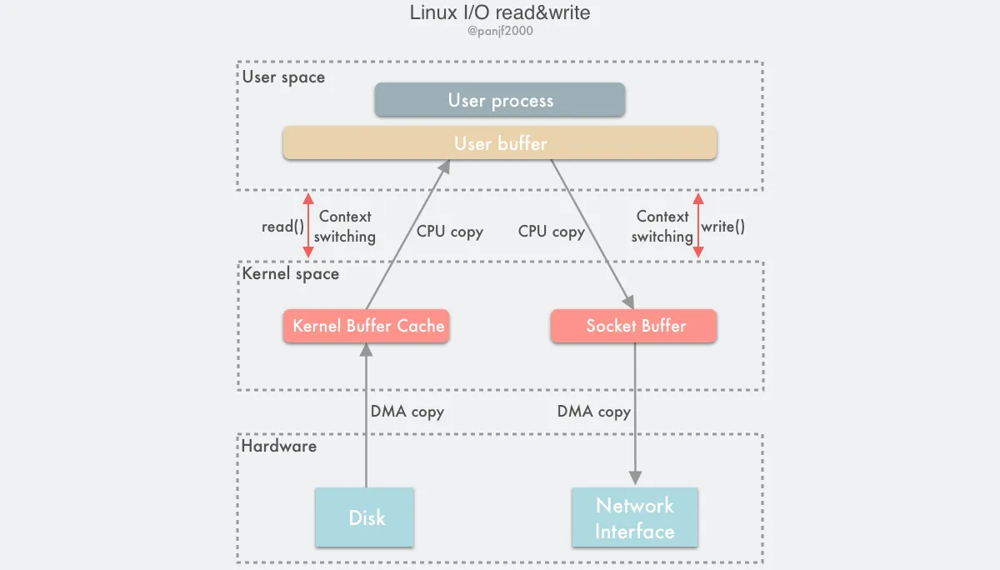

> 参考 https://zhuanlan.zhihu.com/p/308054212
> 
> 参考 https://segmentfault.com/a/1190000041879813?utm_source=sf-similar-article
> [一篇很不错的文章，聊聊Linux I/O](https://www.0xffffff.org/2017/05/01/41-linux-io/?spm=a2c6h.12873639.article-detail.6.58554115pHDyjY)

## 传统IO

## mmap

## senfile
