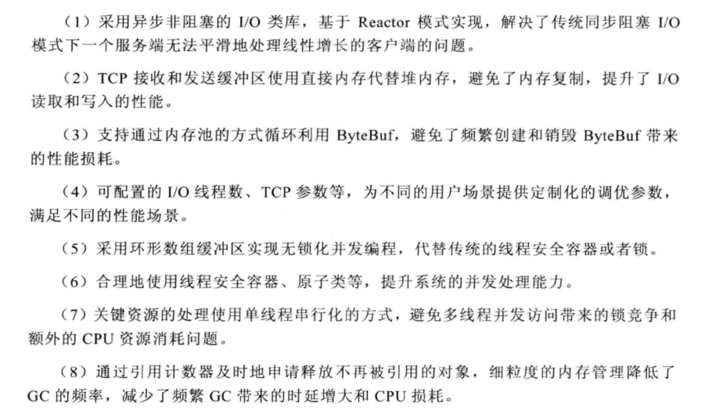
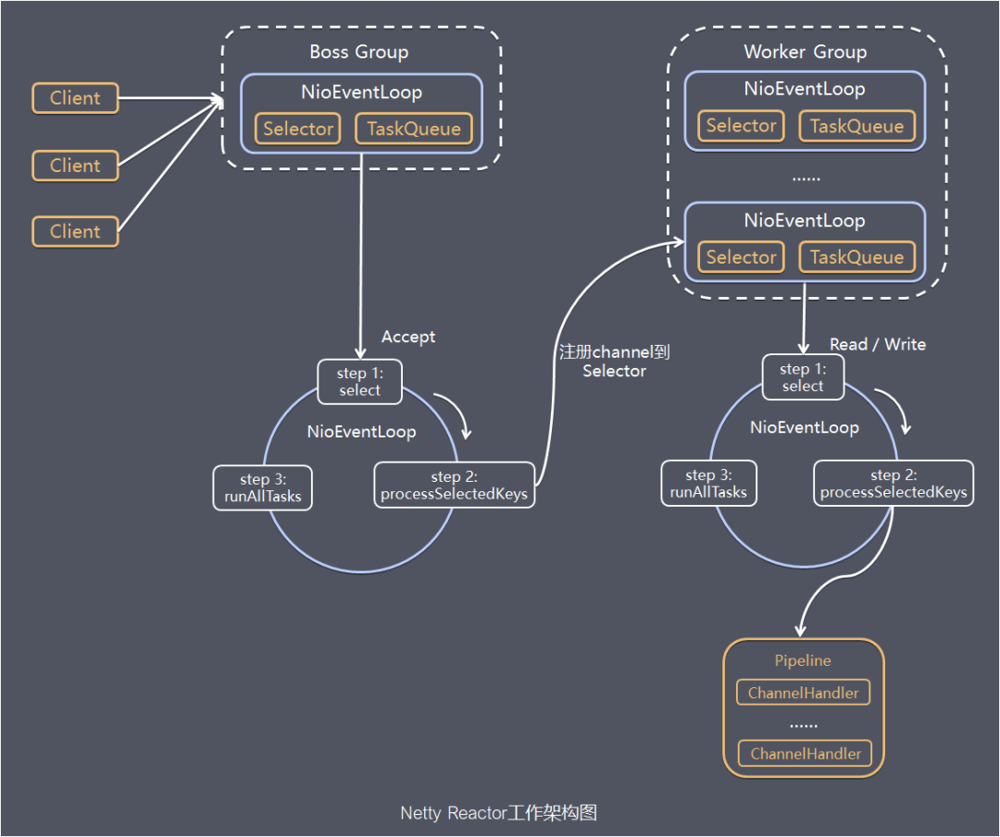
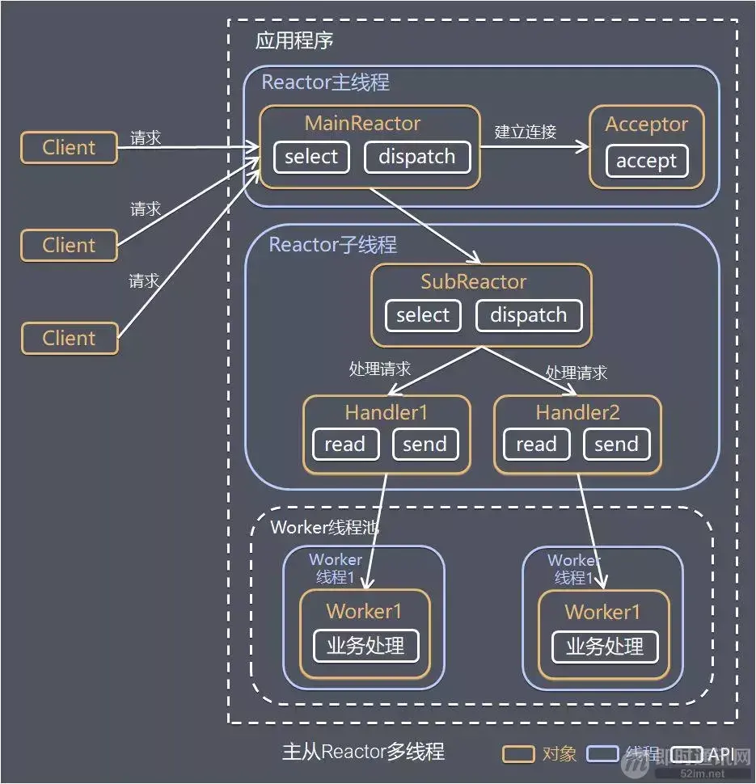
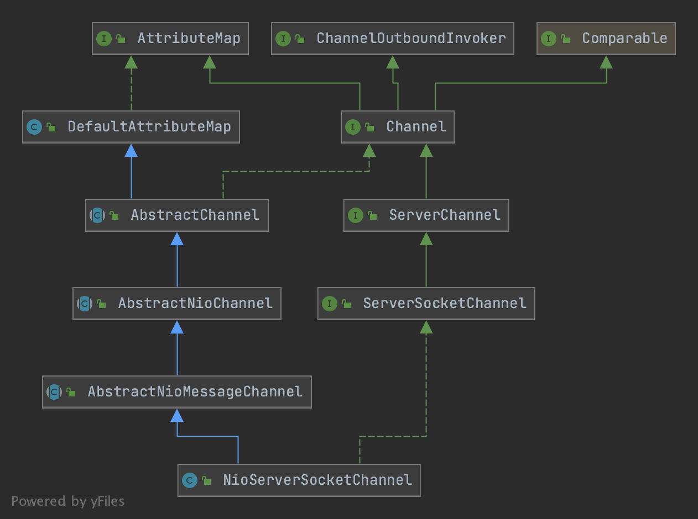
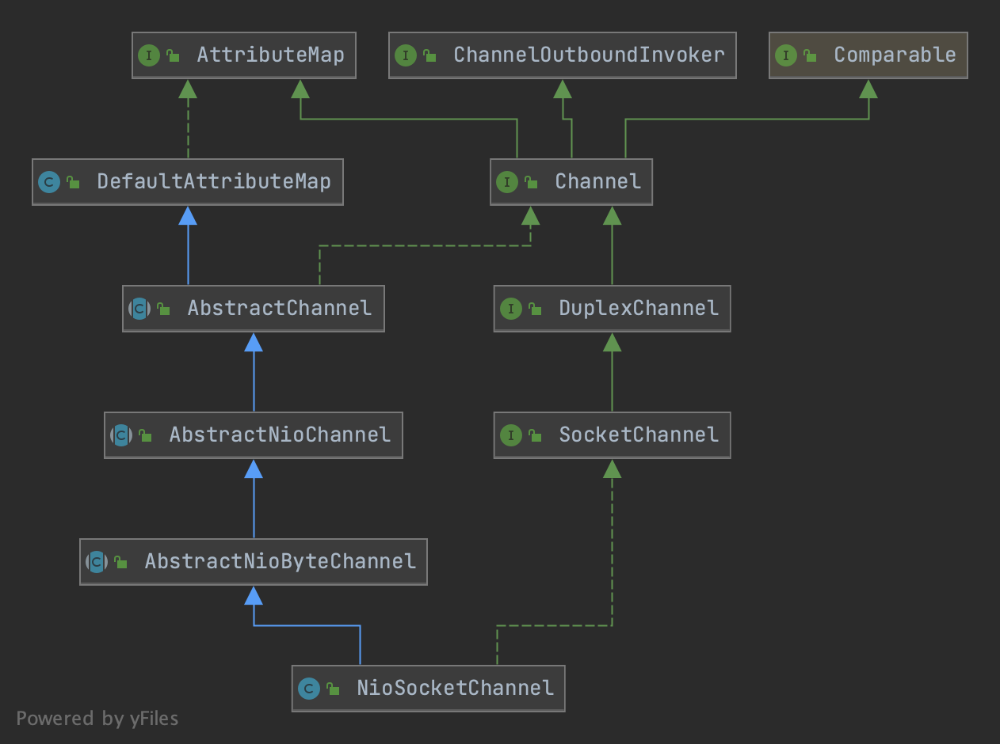

# Netty

## Netty高性能总结


## Netty关键组件

### EventLoop

==>
- BossGroup
- WorkerGroup
- 主从Reactor多线程模型

> 参考链接：https://blog.csdn.net/qq_43203949/article/details/119395403



1. Netty 抽象出两组线程池：BossGroup 和 WorkerGroup，也可以叫做 BossNioEventLoopGroup 和 WorkerNioEventLoopGroup。每个线程池中都有 NioEventLoop 线程。BossGroup 中的线程专门负责和客户端建立连接，WorkerGroup 中的线程专门负责处理连接上的读写。BossGroup 和 WorkerGroup 的类型都是 NioEventLoopGroup。
2. NioEventLoopGroup 相当于一个事件循环组，这个组中含有多个事件循环，每个事件循环就是一个 NioEventLoop。
3. NioEventLoop 表示一个不断循环的执行事件处理的线程，每个 NioEventLoop 都包含一个 Selector，用于监听注册在其上的 Socket 网络连接（Channel）。
4. NioEventLoopGroup 可以含有多个线程，即可以含有多个 NioEventLoop。
5. 每个 BossNioEventLoop 中循环执行以下三个步骤：
    - select：轮训注册在其上的 ServerSocketChannel 的 accept 事件（OP_ACCEPT 事件）
    - processSelectedKeys：处理 accept 事件，与客户端建立连接，生成一个 NioSocketChannel，并将其注册到某个 WorkerNioEventLoop 上的 Selector 上
    - runAllTasks：再去以此循环处理任务队列中的其他任务
6. 每个 WorkerNioEventLoop 中循环执行以下三个步骤：
    - select：轮训注册在其上的 NioSocketChannel 的 read/write 事件（OP_READ/OP_WRITE 事件）
    - processSelectedKeys：在对应的 NioSocketChannel 上处理 read/write 事件
    - runAllTasks：再去以此循环处理任务队列中的其他任务
7. 在以上两个processSelectedKeys步骤中，会使用 Pipeline（管道），Pipeline 中引用了 Channel，即通过 Pipeline 可以获取到对应的 Channel，Pipeline 中维护了很多的处理器（拦截处理器、过滤处理器、自定义处理器等）。

// todo 建立channel 注册channel的过程及实现？


#### 主从Reactor多线程模型实现
> 参考链接：https://www.kancloud.cn/luoyoub/network-programming/2234086
>
> 其他：单Reactor单线程模型  单Reactor多线程模型



### Channel
==>
- NioServerSocketChannel
- NioSocketChannel
- [ChannelOptions](https://edgar615.github.io/netty-option.html)

> Channel: A nexus to a network socket or a component which is capable of I/O operations such as read, write, connect, and bind.

#### NioServerSocketChannel的继承实现


#### NioSocketChannel的继承实现



### ChannelHandlerContext
==>
- DefaultChannelHandlerContext
- ChannelOutboundInvoker
- ChannelInboundInvoker

主要功能：
1. 使`ChannelHandler`能够与其`ChannelPipeline`和其他处理程序进行交互
2. 处理程序可以通知`ChannelPipeline`中的下一个`ChannelHandler`
3. 可以动态修改它所属的`ChannelPipeline`
4. 可以通过`AttributeKey`存储一些和`Channel`/`ChannelHandler`相关的状态信息


### ChannelHandler
==>
- ChannelInBoundHandler (处理InBound事件（入站），ChannelInboundHandlerAdapter为其默认实现)
- ChannelOutBoundHandler (处理OutBound事件（出站），ChannelInboundHandlerAdapter为其默认实现)
- ChannelDuplexHandler （既处理InBound也处理OutBound）
- SimpleChannelInboundHandler (可以用于处理特定类型的消息)
- ChannelInitializer
- Encoder Decoder （TCP粘包/拆包）

// todo 补充更多的编解码 tcp粘包

主要功能：
1. 处理或拦截IO事件，并将其转发到其`ChannelPipeline`中的下一个`Handler`
2. 通过使用`ChannelHandlerContext`对象，`ChannelHandler`可以向上游或下游传递事件，动态修改管道，或存储特定于处理程序的信息（使用`AttributeKeys`）。

一个ChannelHandler可以对应多个ChannelHandlerContext (ChannelHandler.Sharable)

#### 几种常见的Handler
##### DelimiterBasedFrameDecoder
通过指定的字符切割ByteBuf，将ByteBuf解码为Message

构造器
```java
 /**
  * Creates a new instance.
  *
  * @param maxFrameLength  the maximum length of the decoded frame.
  *                        A {@link TooLongFrameException} is thrown if
  *                        the length of the frame exceeds this value. (最大长度，如果超过直接异常)
  * @param stripDelimiter  whether the decoded frame should strip out the
  *                        delimiter or not （数据中是否保留分割符）
  * @param failFast  If <tt>true</tt>, a {@link TooLongFrameException} is
  *                  thrown as soon as the decoder notices the length of the
  *                  frame will exceed <tt>maxFrameLength</tt> regardless of
  *                  whether the entire frame has been read.
  *                  If <tt>false</tt>, a {@link TooLongFrameException} is
  *                  thrown after the entire frame that exceeds
  *                  <tt>maxFrameLength</tt> has been read.
  * @param delimiters  the delimiters （支持多个分割符）
  */
 public DelimiterBasedFrameDecoder(
         int maxFrameLength, boolean stripDelimiter, boolean failFast, ByteBuf... delimiters) {}
```
##### LineBasedFrameDecoder
按行(\n 或 \r\n)解码ByteBuf转为Obj

##### FixedLengthFrameDecoder
固定长度解码ByteBuf转为Obj

##### LengthFieldBasedFrameDecoder
通过长度的字段标识消息长度

构造器参数
```java
 /**
  * Creates a new instance.
  *
  * @param byteOrder
  *        the {@link ByteOrder} of the length field
  * @param maxFrameLength
  *        the maximum length of the frame.  If the length of the frame is
  *        greater than this value, {@link TooLongFrameException} will be
  *        thrown.
  * @param lengthFieldOffset
  *        the offset of the length field
  * @param lengthFieldLength
  *        the length of the length field
  * @param lengthAdjustment
  *        the compensation value to add to the value of the length field
  * @param initialBytesToStrip
  *        the number of first bytes to strip out from the decoded frame
  * @param failFast
  *        If <tt>true</tt>, a {@link TooLongFrameException} is thrown as
  *        soon as the decoder notices the length of the frame will exceed
  *        <tt>maxFrameLength</tt> regardless of whether the entire frame
  *        has been read.  If <tt>false</tt>, a {@link TooLongFrameException}
  *        is thrown after the entire frame that exceeds <tt>maxFrameLength</tt>
  *        has been read.
  */
 public LengthFieldBasedFrameDecoder(
         ByteOrder byteOrder, int maxFrameLength, int lengthFieldOffset, int lengthFieldLength,
         int lengthAdjustment, int initialBytesToStrip, boolean failFast) {}
```

##### HttpServerCodec
http server的handler，一般和HttpObjectAggregator组合使用


### ChannelPipeline

核心要点：
1. 外部事件被动触发 Inbound
2. 内部操作主动触发 Outbound

```html
 *
 *                                                 I/O Request
 *                                            via {@link Channel} or
 *                                        {@link ChannelHandlerContext}
 *                                                      |
 *  +---------------------------------------------------+---------------+
 *  |                           ChannelPipeline         |               |
 *  |                                                  \|/              |
 *  |    +---------------------+            +-----------+----------+    |
 *  |    | Inbound Handler  N  |            | Outbound Handler  1  |    |
 *  |    +----------+----------+            +-----------+----------+    |
 *  |              /|\                                  |               |
 *  |               |                                  \|/              |
 *  |    +----------+----------+            +-----------+----------+    |
 *  |    | Inbound Handler N-1 |            | Outbound Handler  2  |    |
 *  |    +----------+----------+            +-----------+----------+    |
 *  |              /|\                                  .               |
 *  |               .                                   .               |
 *  | ChannelHandlerContext.fireIN_EVT() ChannelHandlerContext.OUT_EVT()|
 *  |        [ method call]                       [method call]         |
 *  |               .                                   .               |
 *  |               .                                  \|/              |
 *  |    +----------+----------+            +-----------+----------+    |
 *  |    | Inbound Handler  2  |            | Outbound Handler M-1 |    |
 *  |    +----------+----------+            +-----------+----------+    |
 *  |              /|\                                  |               |
 *  |               |                                  \|/              |
 *  |    +----------+----------+            +-----------+----------+    |
 *  |    | Inbound Handler  1  |            | Outbound Handler  M  |    |
 *  |    +----------+----------+            +-----------+----------+    |
 *  |              /|\                                  |               |
 *  +---------------+-----------------------------------+---------------+
 *                  |                                  \|/
 *  +---------------+-----------------------------------+---------------+
 *  |               |                                   |               |
 *  |       [ Socket.read() ]                    [ Socket.write() ]     |
 *  |                                                                   |
 *  |  Netty Internal I/O Threads (Transport Implementation)            |
 *  +-------------------------------------------------------------------+
 *
```

### HeapBuffer和DirectBuffer
=>
- UnpooledByteBufAllocator
- PooledByteBufAllocator


## Netty关键流程

### ServerBootstrap启动流程


### NioEventLoop事件循环，读事件触发流程
```html
NioEventLoop#run
   => processSelectedKeys 
   ==> processSelectedKeysOptimized 
   ===> processSelectedKey
   ====> AbstractNioByteChannel#read 
   =====> DefaultChannelPipeline#fireChannelRead
   =====> DefaultChannelPipeline#fireChannelReadComplete
```

### client connect
1. 通过channelFactory new出一个channel
2. 初始化channel（添加pipeline和一些config），并注册到EventLoopGroup中
3. address解析  调用channel connect
4. 调用channel的pipeline connect，从pipline尾部开始分别执行对应context中的handler
5. 调用Socket的connect


