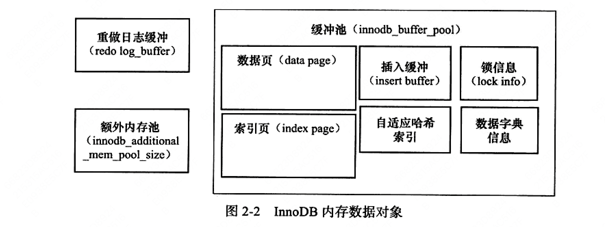

<!-- START doctoc generated TOC please keep comment here to allow auto update -->
<!-- DON'T EDIT THIS SECTION, INSTEAD RE-RUN doctoc TO UPDATE -->
**Table of Contents**  *generated with [DocToc](https://github.com/thlorenz/doctoc)*

- [MySQL InnoDB](#mysql-innodb)
  - [前置文章](#%E5%89%8D%E7%BD%AE%E6%96%87%E7%AB%A0)
  - [Buffer Pool](#buffer-pool)
    - [主要线程和职能](#%E4%B8%BB%E8%A6%81%E7%BA%BF%E7%A8%8B%E5%92%8C%E8%81%8C%E8%83%BD)
    - [关键特性](#%E5%85%B3%E9%94%AE%E7%89%B9%E6%80%A7)
    - [Buffer Pool简单小结](#buffer-pool%E7%AE%80%E5%8D%95%E5%B0%8F%E7%BB%93)
  - [锁](#%E9%94%81)
  - [日志](#%E6%97%A5%E5%BF%97)
  - [索引](#%E7%B4%A2%E5%BC%95)
    - [索引类型](#%E7%B4%A2%E5%BC%95%E7%B1%BB%E5%9E%8B)
    - [创建索引的原则](#%E5%88%9B%E5%BB%BA%E7%B4%A2%E5%BC%95%E7%9A%84%E5%8E%9F%E5%88%99)
    - [索引失效的场景](#%E7%B4%A2%E5%BC%95%E5%A4%B1%E6%95%88%E7%9A%84%E5%9C%BA%E6%99%AF)
  - [整理过程中问题](#%E6%95%B4%E7%90%86%E8%BF%87%E7%A8%8B%E4%B8%AD%E9%97%AE%E9%A2%98)
    - [当行记录数据大小大于页大小（16KB）时，如何存储？](#%E5%BD%93%E8%A1%8C%E8%AE%B0%E5%BD%95%E6%95%B0%E6%8D%AE%E5%A4%A7%E5%B0%8F%E5%A4%A7%E4%BA%8E%E9%A1%B5%E5%A4%A7%E5%B0%8F16kb%E6%97%B6%E5%A6%82%E4%BD%95%E5%AD%98%E5%82%A8)
    - [select如何找到mvcc中具体版本的数据](#select%E5%A6%82%E4%BD%95%E6%89%BE%E5%88%B0mvcc%E4%B8%AD%E5%85%B7%E4%BD%93%E7%89%88%E6%9C%AC%E7%9A%84%E6%95%B0%E6%8D%AE)
    - [undo log存储在哪](#undo-log%E5%AD%98%E5%82%A8%E5%9C%A8%E5%93%AA)
    - [SSD和机械磁盘差异](#ssd%E5%92%8C%E6%9C%BA%E6%A2%B0%E7%A3%81%E7%9B%98%E5%B7%AE%E5%BC%82)
    - [select是否会触发隐式事务](#select%E6%98%AF%E5%90%A6%E4%BC%9A%E8%A7%A6%E5%8F%91%E9%9A%90%E5%BC%8F%E4%BA%8B%E5%8A%A1)
    - [direct io是mmap吗？和其他常规io差异是零拷贝吗？](#direct-io%E6%98%AFmmap%E5%90%97%E5%92%8C%E5%85%B6%E4%BB%96%E5%B8%B8%E8%A7%84io%E5%B7%AE%E5%BC%82%E6%98%AF%E9%9B%B6%E6%8B%B7%E8%B4%9D%E5%90%97)
    - [mysql写时如果数据页没在缓冲区，会先将数据页加载到缓冲区再写，还是直接写?](#mysql%E5%86%99%E6%97%B6%E5%A6%82%E6%9E%9C%E6%95%B0%E6%8D%AE%E9%A1%B5%E6%B2%A1%E5%9C%A8%E7%BC%93%E5%86%B2%E5%8C%BA%E4%BC%9A%E5%85%88%E5%B0%86%E6%95%B0%E6%8D%AE%E9%A1%B5%E5%8A%A0%E8%BD%BD%E5%88%B0%E7%BC%93%E5%86%B2%E5%8C%BA%E5%86%8D%E5%86%99%E8%BF%98%E6%98%AF%E7%9B%B4%E6%8E%A5%E5%86%99)

<!-- END doctoc generated TOC please keep comment here to allow auto update -->

# MySQL InnoDB

## 前置文章
- [MySQL索引总结](https://icankeep.gitbook.io/blog/2019-03/20190314mysql-zhong-suo-yin)
- [MySQL存储引擎](https://icankeep.gitbook.io/blog/2019-03/20190314mysql-cun-chu-yin-qing)
- [MySQL锁机制](https://icankeep.gitbook.io/blog/2019-03/20190314mysql-suo-ji-zhi)
- [InnoDB数据插入流程](https://www.cnblogs.com/wtzbk/p/14410608.html)
- [ChangeBuffer](https://developer.aliyun.com/article/1230041?spm=a2c6h.12873639.article-detail.37.32396393rR0uLB&scm=20140722.ID_community@@article@@1230041._.ID_community@@article@@1230041-OR_rec-V_1-RL_community@@article@@1114025)

## Buffer Pool
- 索引页、数据页、锁、undo页、自适应哈希索引和插入缓冲页
- Free List
- Flush List
- LRU List（预读失效、Buffer Pool污染）
- master thread loop
- write ahead log

### 主要线程和职能
- master thread：核心的后台线程，负责将缓冲区中的数据异步刷新到磁盘， 刷新脏页、merge insert buffer和回收undo页等
- io thread：InnoDB中存在大量AIO，io thread用于处理这些异步请求的回调逻辑
- purge thread：事务被提交后，undo log不再需要，purge thread用于回收已经被分配并使用的undo log页
- page cleaner thread：刷新脏页

### 关键特性
- 插入缓冲区：即insert buffer/change buffer，InnoDB针对非唯一的辅助索引写入专门的优化，会将写入操作先写入到buffer中
  - https://blog.csdn.net/it_lihongmin/article/details/115315120
  - insert buffer底层是一颗B+树，所有表共用一颗
  - Merge Insert Buffer的时机：1、当辅助索引页被读取到缓冲区时 2、Insert Buffer BitMap检测到该页已无可用空间时 3、master thread定时merge
- 两次写：double write，在将数据页写到表时，这时发生宕机，16KB的页可能只写了部分，这时就发生了部分写失效，此时页发生损坏，即使有重做日志，也没有意义
InnoDB通过两次写来解决这种部分写失效的问题，将需要写入的页copy到double write buffer和共享表磁盘空间，由于都是顺序写，开销并不大，后再将buffer中的页写入表空间文件中
- 自适应哈希索引：InnoDB自动根据访问的频率和模式来为某些热点页建立哈希索引
  - where a = xx / where a = xx and b = xxx  若交替以上述模式（where条件）执行，不会建立索引
  - 以该模式访问了100次
  - 页通过该模式访问了N次，其中N=页中记录条数/16
- 异步IO：即AIO，AIO的好处就是可以非常方便的合并多个IO操作，如分别读取多个相邻页时可以合并为一次IO，读取一次。
- 刷新邻接页：刷新脏页时，检查是否有相邻的脏页，如果存在就合并刷新到磁盘

**Double Write**

### Buffer Pool简单小结
Innodb 存储引擎设计了一个缓冲池（Buffer Pool），来提高数据库的读写性能。

Buffer Pool 以页为单位缓冲数据，可以通过 innodb_buffer_pool_size 参数调整缓冲池的大小，默认是 128 M。

Innodb 通过三种链表来管理缓页：

Free List （空闲页链表），管理空闲页；
Flush List （脏页链表），管理脏页；
LRU List，管理脏页+干净页，将最近且经常查询的数据缓存在其中，而不常查询的数据就淘汰出去。；
InnoDB 对 LRU 做了一些优化，我们熟悉的 LRU 算法通常是将最近查询的数据放到 LRU 链表的头部，而 InnoDB 做 2 点优化：

将 LRU 链表 分为young 和 old 两个区域，加入缓冲池的页，优先插入 old 区域；页被访问时，才进入 young 区域，目的是为了解决预读失效的问题。
当**「页被访问」且「 old 区域停留时间超过 innodb_old_blocks_time 阈值（默认为1秒）」**时，才会将页插入到 young 区域，否则还是插入到 old 区域，目的是为了解决批量数据访问，大量热数据淘汰的问题。
可以通过调整 innodb_old_blocks_pct 参数，设置 young 区域和 old 区域比例。

在开启了慢 SQL 监控后，如果你发现「偶尔」会出现一些用时稍长的 SQL，这可因为脏页在刷新到磁盘时导致数据库性能抖动。如果在很短的时间出现这种现象，就需要调大 Buffer Pool 空间或 redo log 日志的大小。

> 参考博客：https://xiaolincoding.com/mysql/buffer_pool/buffer_pool.html#%E4%B8%BA%E4%BB%80%E4%B9%88%E8%A6%81%E6%9C%89-buffer-pool

## 锁
- S锁：读锁
- X锁：写锁
- IS锁：意向读锁
- IX锁：意向写锁

- Record Lock
- Gap Lock
- Next Key Lock

## 日志
- redo log：是Innodb 存储引擎层生成的日志，实现了事务中的持久性，主要用于掉电等故障恢复。顺序写
  - **刷新**：master thread每秒刷新、事务提交时、redo缓冲区可用空间小于一半时
- undo log：是Innodb 存储引擎层生成的日志，实现了事务中的原子性，主要用于事务回滚和 MVCC。随机读写
  - 当事务提交时：1、会将undo log页放入列表中，以供之后的purge操作  2、判断undo页是否可重用（可用空间是否大于1/4），若可以则分配给下一个事务使用
- binlog：是 Server 层生成的日志，主要用于数据备份和主从复制。

## 索引
### 索引类型
- 聚簇索引：每个表都会有一个聚簇索引，如果表存在主键就是用主键顺序，如果不存在主键会生成隐式主键。叶子节点中包含行数据。
- 非聚簇索引（辅助索引/二级索引）： 需要通过非聚簇索引的B+树找到对应节点，节点中包含主键信息，根据主键信息再通过聚簇索引找到对应的行记录，这个过程叫做回表。当查询信息只包含主键或索引列时，这时不会回表，这叫做索引覆盖。

- 联合索引
- 覆盖索引
- 自适应哈希索引：由InnoDB优化自行创建，无法手动创建

### 创建索引的原则
- 列区分度较大
- 经常会被使用到的列
- 更新特别频繁的列不建议创建索引
- 尽量控制索引个数，索引不是越多越好
- 尽量使用短索引

### 索引失效的场景
Hash索引：
 - 只用于使用=或<=>操作符的等式比较，只适用于key-value查询
 - Hash索引不适用于范围查询，例如<、>、<=、>=这类操作

B-Tree索引：
 - 以%开头的LIKE查询不能利用B-Tree索引
 - 数据类型出现隐式转换的时候也不会使用索引，特别是当列类型是字符串，要将字符串用引号引起来索引才生效
 - 复合索引的情况下，假如查询条件不包含索引列最左边部分，即不满足最左原则，是不会使用复合索引的，右边可以没有，左边和中间不能缺
 - 如果MySQL估计使用索引比全表扫描更慢，则不使用索引
 - 用or分割开的条件，每一列都要有索引才能使用索引

## 整理过程中问题
### 当行记录数据大小大于页大小（16KB）时，如何存储？
行记录在数据页中的存储结构

https://mp.weixin.qq.com/s/A5gNVXMNE-iIlY3oofXtLw

一个页中至少需要两行数据，溢出的数据存储在新的一个页里面，留出部分字节存储溢出页信息

### select如何找到mvcc中具体版本的数据
通过read view和undo log，readview中记录了当前行记录已提交和未提交的事务，根据事务隔离级别，选择对应版本的undo log，生成具体版本的行记录
http://imodou.com.cn/article/MySQL%20MVCC%E5%BA%95%E5%B1%82%E5%8E%9F%E7%90%86%E8%AF%A6%E8%A7%A3.html#_3-%E7%89%88%E6%9C%AC%E9%93%BE

### undo log存储在哪
存储在共享表空间， rollback segment，一个rollback segment对应1024个undo log segment，在每个undo log segment中进行undo页的申请

### SSD和机械磁盘差异

### select是否会触发隐式事务
insert/update/delete会触发隐式事务，select不会

### direct io是mmap吗？和其他常规io差异是零拷贝吗？
mmap是把page cache地址空间映射到用户空间，像操作应用层内存一样写文件，省去了系统调用的开销

direct io是避开了page cache，数据直接写磁盘数据块

https://www.cnblogs.com/bandaoyu/p/16752377.html

### mysql写时如果数据页没在缓冲区，会先将数据页加载到缓冲区再写，还是直接写?

