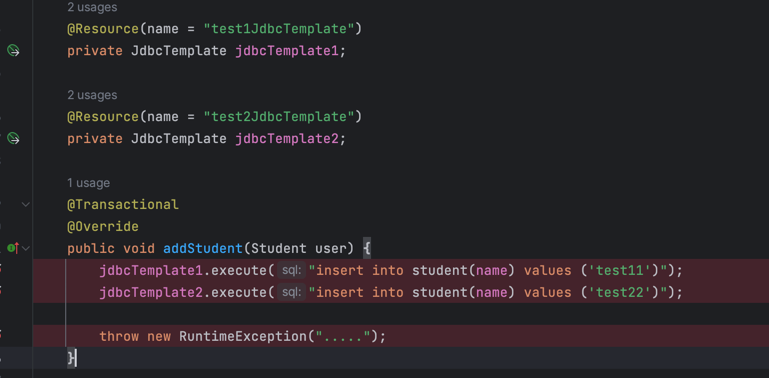
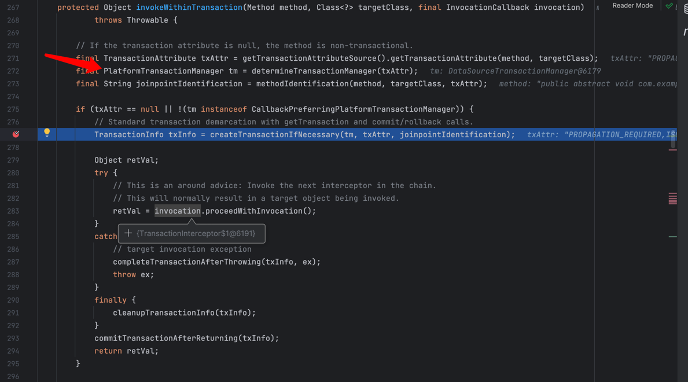

<!-- START doctoc generated TOC please keep comment here to allow auto update -->
<!-- DON'T EDIT THIS SECTION, INSTEAD RE-RUN doctoc TO UPDATE -->
**Table of Contents**  *generated with [DocToc](https://github.com/thlorenz/doctoc)*

- [现象](#%E7%8E%B0%E8%B1%A1)
- [@Transactional注解原理](#transactional%E6%B3%A8%E8%A7%A3%E5%8E%9F%E7%90%86)
  - [快速上手](#%E5%BF%AB%E9%80%9F%E4%B8%8A%E6%89%8B)
  - [debug分析](#debug%E5%88%86%E6%9E%90)
- [简单总结](#%E7%AE%80%E5%8D%95%E6%80%BB%E7%BB%93)
  - [实验代码](#%E5%AE%9E%E9%AA%8C%E4%BB%A3%E7%A0%81)

<!-- END doctoc generated TOC please keep comment here to allow auto update -->

## 现象



如图， jdbcTemplate1表示数据源1，jdbcTemplate2表示数据源2

addStudent该方法执行后，数据源1也就是第一行的数据不会被插入

数据源2执行的插入会插入

并不符合之前对transactional注解的认知，transactional底层应该是通过动态代理对添加了该注解的方法添加环绕切面

伪代码应该是
```java
// 关闭自动提交事务
// 开启事务
try {
    // 执行方法
} catch (Throwable t) {
    // 回滚事务 
}
// 提交事务
```

按照上述的流程，理论上数据源1和数据源2插入的内容都应该被回滚，所以来了解下transactional的实现流程

## @Transactional注解原理

### 快速上手
一篇不错的文章
https://blog.csdn.net/minghao0508/article/details/125834496

### debug分析
核心代码主要在 `TransactionAspectSupport#invokeWithinTransaction` 中



大概框架和预想中的差不多

1. 获取事务管理器

    这里是最重要的，他会根据transactional注解上的一些属性（如qualifier等）返回对应事务管理器
    
    如果没有指定，会返回@Primary注解对应的DataSource的事务管理器，而并不是根据哪个数据源先在方法执行就取谁，
    
    因为在这个层面感知不到方法里面的逻辑

    ```java
    final PlatformTransactionManager tm = determineTransactionManager(txAttr);
    ```

2. 创建事务/执行方法逻辑
    ```java
     TransactionInfo txInfo = createTransactionIfNecessary(ptm, txAttr, joinpointIdentification);
    ```
3. 执行方法逻辑/异常回滚/清理事务上下文信息
    ```java
    Object retVal;
    try {
        // This is an around advice: Invoke the next interceptor in the chain.
        // This will normally result in a target object being invoked.
        retVal = invocation.proceedWithInvocation();
    }
    catch (Throwable ex) {
        // target invocation exception
        completeTransactionAfterThrowing(txInfo, ex);
        throw ex;
    }
    finally {
        cleanupTransactionInfo(txInfo);
    }
    ```
4. 正常提交
    ```java
    commitTransactionAfterReturning(txInfo);
    ```

## 简单总结
结论：跨数据源用transactional注解无法完全回滚，只能回滚指定数据源的数据，如果需要回滚所有数据源的数据，需要
自行定义注解（支持传入多个transactionManager）完成切面逻辑，针对多个transactionManager分别开启事务/提交事务/回滚事务

### 实验代码
https://github.com/icankeep/transactional-lab

### 自定义多数据源回滚注解
https://blog.csdn.net/u014644574/article/details/128857774