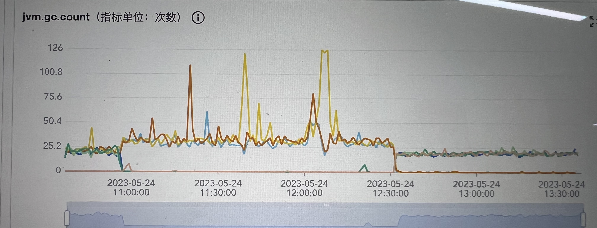

<!-- START doctoc generated TOC please keep comment here to allow auto update -->
<!-- DON'T EDIT THIS SECTION, INSTEAD RE-RUN doctoc TO UPDATE -->
**Table of Contents**  *generated with [DocToc](https://github.com/thlorenz/doctoc)*

- [问题](#%E9%97%AE%E9%A2%98)
- [排查路径](#%E6%8E%92%E6%9F%A5%E8%B7%AF%E5%BE%84)
  - [1、初步定位问题](#1%E5%88%9D%E6%AD%A5%E5%AE%9A%E4%BD%8D%E9%97%AE%E9%A2%98)
  - [2、发现问题](#2%E5%8F%91%E7%8E%B0%E9%97%AE%E9%A2%98)
  - [3、解决问题](#3%E8%A7%A3%E5%86%B3%E9%97%AE%E9%A2%98)
  - [4、扩展问题](#4%E6%89%A9%E5%B1%95%E9%97%AE%E9%A2%98)
    - [TCP状态扩展](#tcp%E7%8A%B6%E6%80%81%E6%89%A9%E5%B1%95)
    - [出现了大量TIME_WAIT连接，主要是什么原因？](#%E5%87%BA%E7%8E%B0%E4%BA%86%E5%A4%A7%E9%87%8Ftime_wait%E8%BF%9E%E6%8E%A5%E4%B8%BB%E8%A6%81%E6%98%AF%E4%BB%80%E4%B9%88%E5%8E%9F%E5%9B%A0)

<!-- END doctoc generated TOC please keep comment here to allow auto update -->

# 问题
线上服务大量请求异常，登录到机器发现主要日志如下
```bash
 I/O exception (java.net.NoRouteToHostException) caught when processing request to {}->http://xxx.com:80: Cannot assign requested address (Address not available)
```

看日志查询了下，发现可能是服务器连接打满了([stackoverflow](https://stackoverflow.com/questions/28089839/what-is-java-net-noroutetohostexception-cannot-assign-requested-address))

登录到机器查看连接数
```bash
netstat -antp
```

发现了大量的连接处于CLOSE WAIT状态
```bash
netstat -antp | grep CLOSE_WAIT
```
比较严重的机器大概有十几万个CLOSE WAIT连接

# 排查路径
## 1、初步定位问题

找到这些连接对应的远端ip，以及找到对应服务，定位到对应调用代码

```bash
# 根据远端ip, sort并去重排序
netstat -antp | grep CLOSE_WAIT | awk '{print $5}' | sort | uniq -c
```
发现有问题连接主要集中在某个服务上的ip上，我们服务调用该服务主要通过HTTP方式
HttpClient使用Spring RestTemplate，请求代码如下
```java
HttpHeaders headers = buildGetDefaultHttpHeader();
HttpEntity<String> httpEntity = new HttpEntity<>(headers);
HttpClientBuilder builder =
        HttpClientBuilder.create().setRetryHandler(new DefaultHttpRequestRetryHandler(3, false));
HttpClient httpClient = builder.build();

ClientHttpRequestFactory requestFactory = new HttpComponentsClientHttpRequestFactory(httpClient);

RestTemplate restTemplate = new RestTemplate(requestFactory);

ResponseEntity<String> response = restTemplate.exchange(url, HttpMethod.GET, httpEntity, String.class);
```

## 2、发现问题

每次请求都会创建一个RestTemplate，对应着会创建一个HttpClient以及连接池对象，会带来以下三个问题：
- 性能开销：每次创建新的 RestTemplate 实例时，都需要初始化连接管理器、HTTP客户端等相关资源。这会增加系统的性能开销，导致请求处理速度变慢。
- 资源浪费：每个 RestTemplate 实例都会维护自己的连接池。如果每次请求都创建新的实例，那么每个实例的连接池都可能只被使用一次，造成资源浪费。
- 连接过多：由于每个 RestTemplate 实例都有自己的连接池，如果每次请求都创建新的实例，可能会导致大量的连接被创建，从而消耗系统资源，甚至导致系统崩溃。
- 连接发生泄露情况：由于每次都会新建 RestTemplate 实例，对应的连接池（PoolingHttpClientConnectionManager中的CPool）中的连接在对象回收时可能无法被正确释放，
PoolingHttpClientConnectionManager的finalize方法虽然会进行shutdown，但对象回收是finalize并不是可靠执行的，所以可能存在连接没有被正确释放的情况。

为了避免这些问题，需要使用单例模式创建 RestTemplate 实例，该实例是线程安全的，且这样可以复用连接池和HTTP客户端资源，提高性能并减少资源浪费。
在Spring框架中，可以通过将 RestTemplate 定义为一个Bean来实现单例模式：
```java
@Configuration
public class RestTemplateConfig {
    @Bean
    public RestTemplate restTemplate() {
        RestTemplate restTemplate = new RestTemplate(RestTemplateConfig.newClientHttpRequestFactory());
        return restTemplate;
    }

    // ...
}
```

### 抓包分析
使用tcpdump抓包
```bash
tcpdump -i eth0 tcp and host 需要抓包的host -w request.cap
```

通过wireshark打开包文件，进行简单分析


1. 首先进行TCP三次握手
2. 正常HTTP请求及响应，发送以及接收数据包
3. 经过200s后，被HTTP请求的服务端主动发送FIN标志位数据包请求断开连接，服务端回了ACK，但没有再发送FIN

## 3、解决问题
结合服务情况，每次请求获取RestTemplate单例
```java
@Configuration
public class RestTemplateConfig {
    @Bean
    public RestTemplate restTemplate() {
        RestTemplate restTemplate = new RestTemplate(RestTemplateConfig.newClientHttpRequestFactory());
        restTemplate.setInterceptors(Lists.newArrayList(new CatHttpProcessor()));
        return restTemplate;
    }
    
    public static ClientHttpRequestFactory newClientHttpRequestFactory() {
        // 长连接保持时长30秒
        PoolingHttpClientConnectionManager pollingConnectionManager =
                new PoolingHttpClientConnectionManager(30, TimeUnit.SECONDS);
        // 最大连接数
        pollingConnectionManager.setMaxTotal(3000);
        // 单连接的并发数
        pollingConnectionManager.setDefaultMaxPerRoute(100);
        HttpClientBuilder httpClientBuilder = HttpClients.custom();
        httpClientBuilder.setConnectionManager(pollingConnectionManager);
        // 如果不执行下面两行，即使PoolingHttpClientConnectionManager设置了闲置连接存活时间，也不会主动回收
        // 只有执行下面两行，才会启动 过期和闲置连接释放的线程，具体逻辑可查看HttpClientBuilder#build
        httpClientBuilder.evictExpiredConnections();
        httpClientBuilder.evictIdleConnections(30, TimeUnit.SECONDS);
        
        // 当失败时重试次数3次
        // 当发生InterruptedIOException UnknownHostException ConnectException SSLException，不会进行重试
        httpClientBuilder.setRetryHandler(new DefaultHttpRequestRetryHandler(3, false));
        // 保持长连接配置，需要在头添加Keep-Alive
        httpClientBuilder.setKeepAliveStrategy(new DefaultConnectionKeepAliveStrategy());
        HttpClient httpClient = httpClientBuilder.build();
        // httpClient连接底层配置clientHttpRequestFactory
        HttpComponentsClientHttpRequestFactory clientHttpRequestFactory =
                new HttpComponentsClientHttpRequestFactory(httpClient);
        // 主要分为三种超时时间，1、获取连接超时 connectionRequestTimeout 2、连接target超时 connectTimeout
        // 3、读取响应超时，通常抛出SocketTimeoutException
        clientHttpRequestFactory.setConnectTimeout(3000);
        clientHttpRequestFactory.setReadTimeout(3000);
        return clientHttpRequestFactory;
    }
}
```

## 改造后效果
减少一些机器负载，数据上少了很多毛刺，机器上CLOSE_WAIT也基本没了，存在少量TIME_WAIT，比较符合预期

机器负载，可看12.30前后对比


gc次数，可看12.30前后对比



## 4、扩展问题

### TCP状态扩展
CLOSE_WAIT通常发生在连接被动关闭端，详细可查看TCP四次挥手流程，如下图


[这篇文章讲的不错](https://juejin.cn/post/6844903734300901390)

用中文来描述下这个过程：
1. Client: 服务端大哥，我事情都干完了，准备撤了，这里对应的就是客户端发了一个FIN
2. Server：知道了，但是你等等我，我还要收收尾，这里对应的就是服务端收到 FIN 后回应的 ACK

经过上面两步之后，服务端就会处于 CLOSE_WAIT 状态。过了一段时间 Server 收尾完了

3. Server：小弟，哥哥我做完了，撤吧，服务端发送了FIN
4. Client：大哥，再见啊，这里是客户端对服务端的一个 ACK

到此服务端就可以跑路了，但是客户端还不行。为什么呢？客户端还必须等待 2MSL 个时间，这里为什么客户端还不能直接跑路呢？主要是为了防止发送出去的 ACK 服务端没有收到，服务端重发 FIN 再次来询问，如果客户端发完就跑路了，那么服务端重发的时候就没人理他了。这个等待的时间长度也很讲究。

Maximum Segment Lifetime 报文最大生存时间，它是任何报文在网络上存在的最长时间，超过这个时间报文将被丢弃

这里一定不要被图里的 client／server 和项目里的客户端服务器端混淆，你只要记住：主动关闭的一方发出 FIN 包（Client），被动关闭（Server）的一方响应 ACK 包，此时，被动关闭的一方就进入了 CLOSE_WAIT 状态。如果一切正常，稍后被动关闭的一方也会发出 FIN 包，然后迁移到 LAST_ACK 状态。


### 出现了大量TIME_WAIT连接，主要是什么原因？

[详细介绍可查看这篇文章](https://xiaolincoding.com/network/3_tcp/tcp_interview.html#%E6%9C%8D%E5%8A%A1%E5%99%A8%E5%87%BA%E7%8E%B0%E5%A4%A7%E9%87%8F-time-wait-%E7%8A%B6%E6%80%81%E7%9A%84%E5%8E%9F%E5%9B%A0%E6%9C%89%E5%93%AA%E4%BA%9B)


