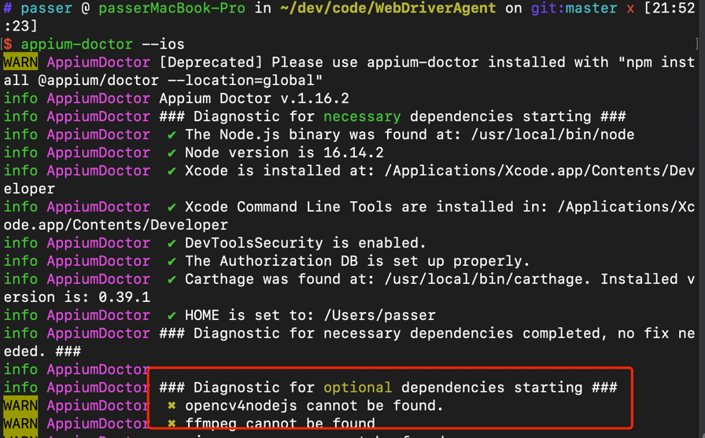
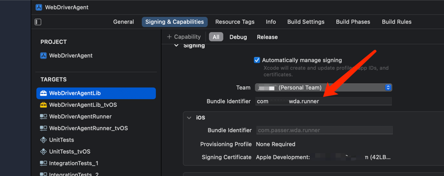
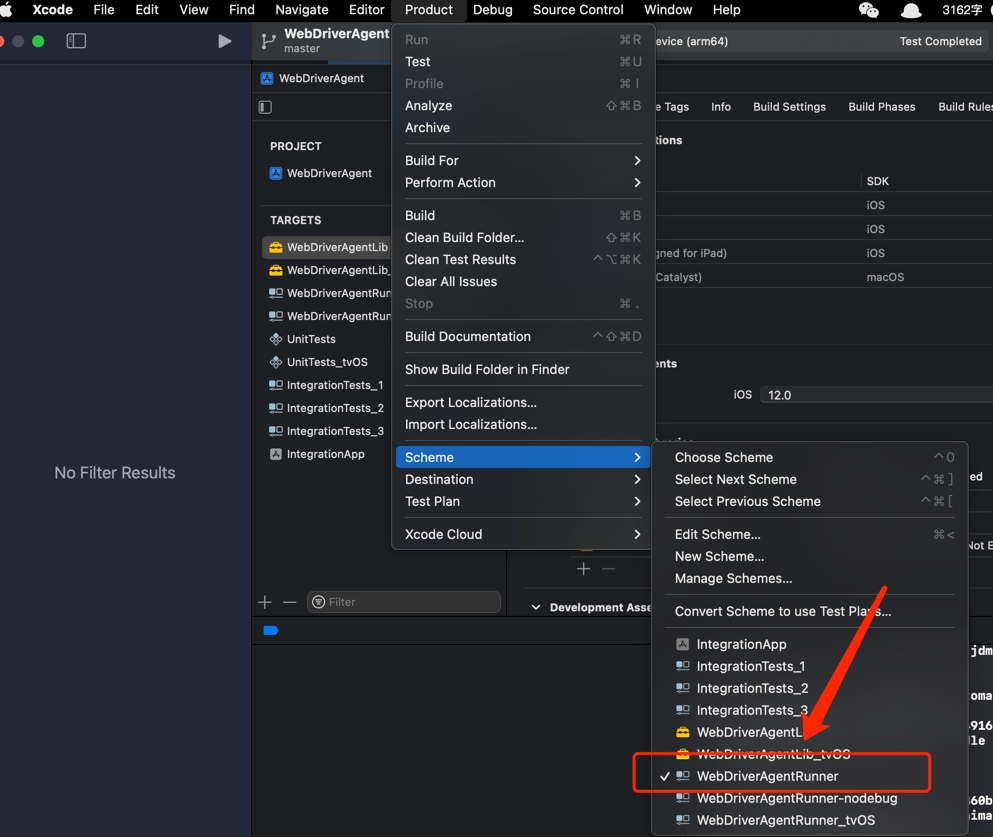
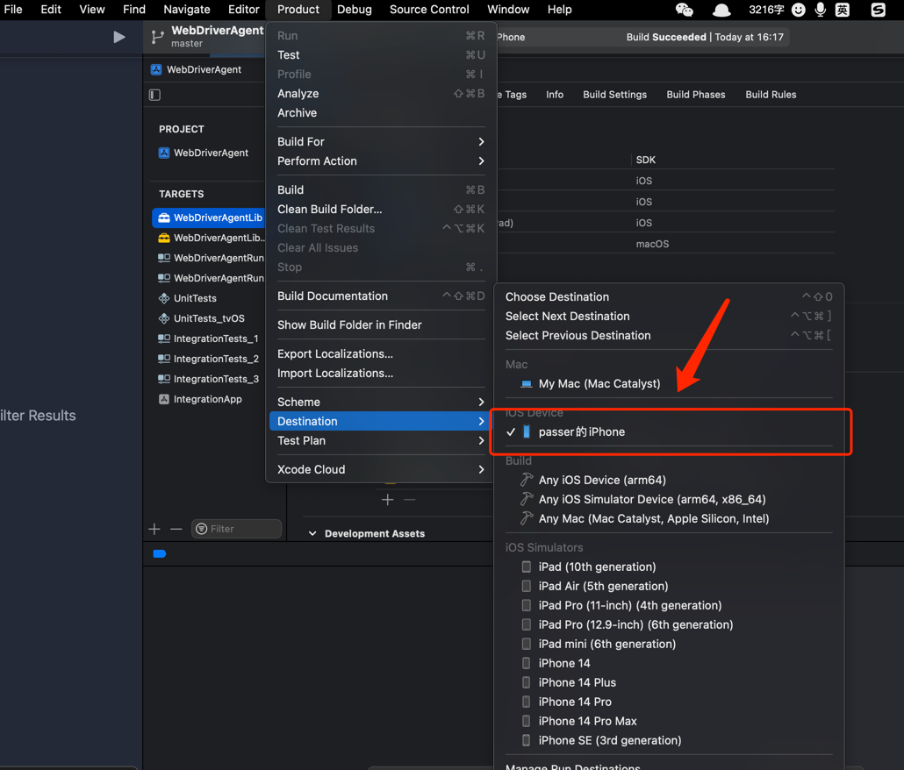
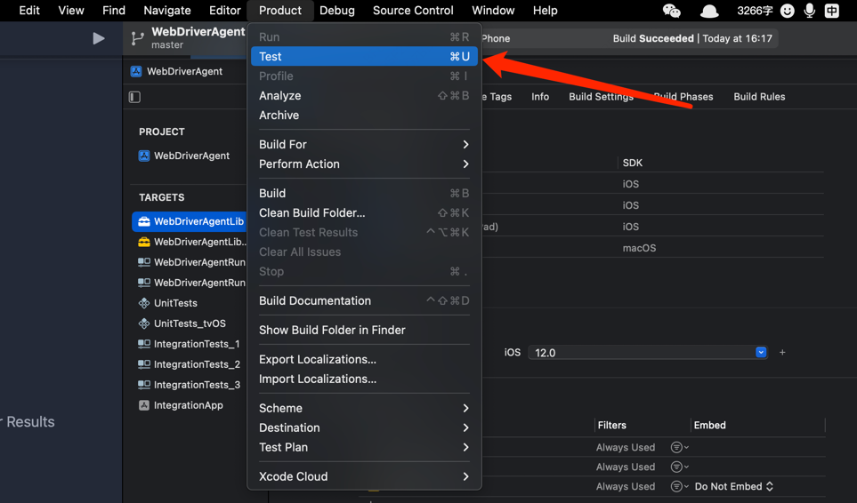
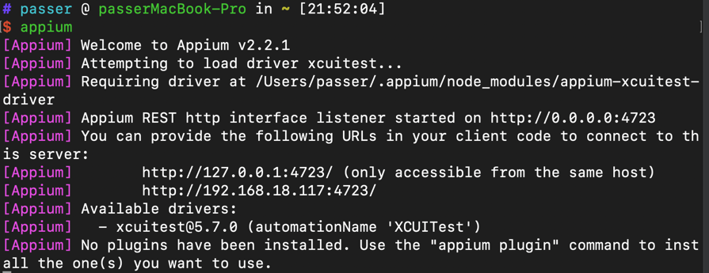
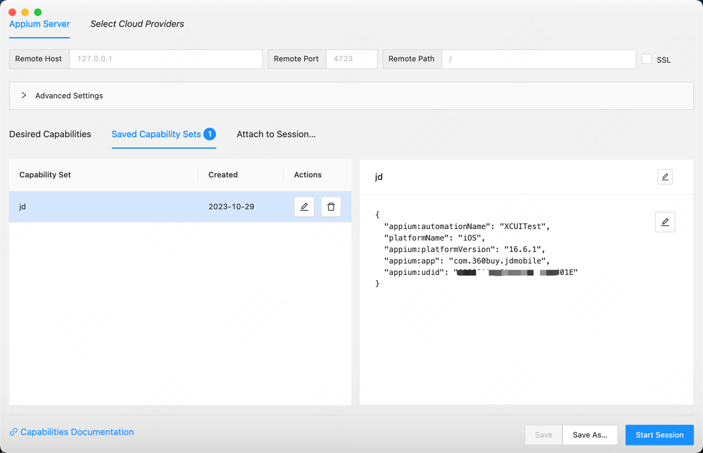

## 一、简单介绍 // Introduce
背景需求就是想通过Python等脚本自动化执行触发iOS App中的一些动作

大致了解了一下，通过Appium可能是不错的方式

安装过程十分坎坷，过程中看的文档也写的不是特别清楚，踩了不少坑，总结一下在Mac上通过脚本控制iOS App的安装以及开发过程

## 二、安装 // Install
### 2.1 安装appium前置依赖
- 安装brew（省略）
- 安装nodejs （省略）
- 安装npm（省略）
- 安装Xcode
  - 可从App Store搜索安装
- 安装Xcode Command Line Tools
  ```bash
  xcode-select --install
  # 如果执行后报错 xcode-select: error: command line tools are already installed, use "Software Update" to install updates
  # 请执行
  xcode-select –switch /Applications/Xcode.app/Contents/Developer
  # 验证
  xcodebuild -version
  ```
- 安装其他依赖
    ```bash
    brew install libimobiledevice --HEAD
    brew install carthage
    npm install -g ios-deploy
    gem install xcpretty
    ```

### 2.2 安装appium

```bash
npm install -g appium
npm install -g appium-doctor

# 驱动安装
appium driver install xcuitest
```

### 2.3 检测安装
```bash
appium-doctor --ios
```

可以忽略这部分`optional`的依赖检测


### appium-inspector
GitHub: https://github.com/appium/appium-inspector
安装包下载：https://github.com/appium/appium-inspector/releases

### WDA

#### Clone WDA项目
```bash
# https://appium.github.io/appium-xcuitest-driver/5.7/run-preinstalled-wda/
# 不要用facebook的那个，且不需要执行 ./Scripts/bootstrap.sh
git clone https://github.com/appium/WebDriverAgent
```

#### xcode打开
clone之后直接使用xcode打开 `WebDriverAgent.xcodeproj`

#### 配置Bundle相关信息

Team直接选个人Team

Bundle Identifier随便填一个，如 `com.xxx.wda.runner`，xxx随便填一个



#### 配置scheme

scheme选择`WebDriverAgentRunner`



#### 连接手机配置destination

数据线连接上电脑就会显示自己的手机了

> 手机需要开启开发者模式，在设置 -> 安全隐私 中开启即可



#### 测试

点击测试后就会触发编译，成功后手机上会安装对应的应用


### 启动appium

```bash
# 直接终端启动server即可
appium
```



### 启动appium-inspector
界面化操作app，方便通过鼠标获取位置元素等



### 使用Python脚本自动化执行（optional）

#### 安装Python环境
省略...

#### SDK介绍
- sdk中提供的find_element等接口可以通过XPATH等获取指定元素，获取指定元素后可以进行点击或其他动作
- sdk中提供了一些模拟的动作，如点击、长按的动作

Refer: https://www.browserstack.com/guide/touch-actions-in-appium#toc3


#### 执行脚本
```bash
python test.py
```

```python
from appium import webdriver
from appium.webdriver.common.touch_action import TouchAction

caps = {}
caps["appium:automationName"] = "XCUITest"
caps["platformName"] = "iOS"
caps["appium:platformVersion"] = "16.6.1"
caps["appium:app"] = "com.360buy.jdmobile"
caps["appium:udid"] = "00008110-0019694A0ABB801E"
caps["appium:includeSafariInWebviews"] = True
caps["appium:newCommandTimeout"] = 3600
caps["appium:connectHardwareKeyboard"] = True
caps["appium:noReset"] = True

driver = webdriver.Remote(command_executor="http://127.0.0.1:4723", desired_capabilities=caps)

# driver.find_element(AppiumBy.XPATH, "//XCUIElementTypeOther[@name=\"华为mate60pro 搜索栏\"]").click()
touch = TouchAction(driver=driver)
touch.tap(x=163, y=106).perform()

# driver.find_element(AppiumBy.XPATH, "(//XCUIElementTypeStaticText[@name=\"mate60pro\"])[1]").click()
touch = TouchAction(driver=driver)
touch.tap(x=60, y=151).perform()

# driver.find_element(AppiumBy.XPATH, "//XCUIElementTypeStaticText[@name=\"查看更多\"]").click()
touch = TouchAction(driver=driver)
touch.tap(x=203, y=450).perform()

# driver.find_element(AppiumBy.XPATH, "//XCUIElementTypeOther[@name=\"华为-手机专区\"]/XCUIElementTypeLink[2]").click()
touch = TouchAction(driver=driver)
touch.tap(x=118, y=279).perform()

driver.quit()
```

## 三、总结 // Summary

上述过程中软件版本如下，可供参考
```bash
PC系统 => MacOS 13.3.1
手机iOS版本 => 16.6.1
nodejs版本 => 16.14.2
npm版本 => 8.5.0
appium => 2.2.1
python版本 => 3.9.17

# 这两个版本需要注意，如果不一样，可能上面的python脚本不兼容
Appium-Python-Client => 2.8.0
selenium => 4.8.3
```

### 引用 // Refer
- 主要参考：https://www.jianshu.com/p/ae0959d19665?utm_campaign=maleskine...&utm_content=note&utm_medium=seo_notes&utm_source=recommendation
- 坑点排除：https://blog.csdn.net/xlyrh/article/details/108410738
- 
- Appium: https://appium.io/docs/en/2.1/guides/caps/
- 获取iOS App Bundle ID: https://commandnotfound.cn/tools/ios-app-bundle-id?id=414245413
- Apple 基础应用 Bundle ID List: https://support.apple.com/zh-cn/guide/deployment/depece748c41/web


#### Extra Info
- 命令行操作连接设备 idb: https://github.com/appium/appium-idb
```bash
idb list-targets | grep Boot 

idb list-apps --udid 00008110-0019694A0ABB801E

idb launch com.meitu.mtxx
```


